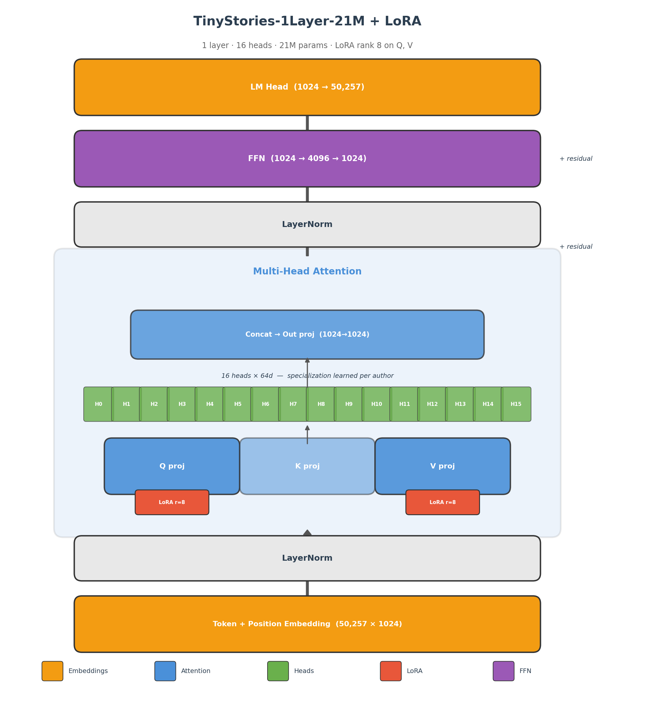
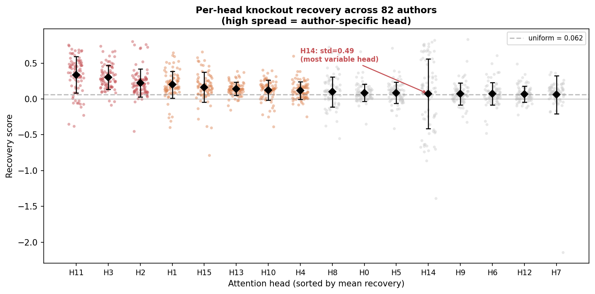
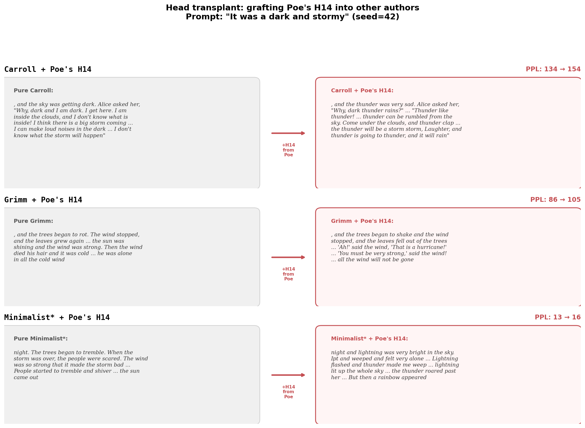

# Sixteen Voices: What Happens Inside Attention Heads When You Adapt for Style

*A mechanistic interpretability experiment with LoRA-adapted transformers*

---

You know what is beautiful about tiny models? That they are tiny.

Twenty-one million parameters. One attention layer. Sixteen heads. You
could literally put this model in your pocket, if it existed physically.
And yet — no one understands what is happening inside.

So I made an experiment. Eighty-two LoRA adapters, each trained on a
different author — Carroll, Poe, Lovecraft, the Brothers Grimm,
Melville, Yeats — all squeezed through the same sixteen heads.

The question was simple: **do different authors use different heads?**

It turns out some heads matter a lot and others don't — and the pattern
is different per author. When you isolate a single head's contribution,
you can measure how much of the adaptation it carries.

---

A disclaimer: the model was pre-trained on TinyStories, a dataset of
short children's stories. It will never write like Poe. But it *can*
shift its output distribution in measurably different directions for
each author — and a model this small lets you draw the full map, which
you simply can't do with a hundred-layer transformer.

---

Here's what the adaptation looks like. Same prompt, same seed
(prompt: *"It was a dark and stormy"*, seed=42):

> **Base model:** day. But I was brave and strong." So, the little
> girl said, "I will get us. I'm strong." And everyone cheered, and
> the little girl made sure she was happy. The End.
>
> **Poe:** , and the trees began to have to stop him from his bed. The
> dark and sky wept. The dark sky above the clouds seemed to go away
> and, in the night above the clouds.
>
> **Carroll:** , and the sky was getting dark. Alice asked her, "Why,
> dark and I am dark. I get here. I am inside the clouds, and I don't
> know what is inside! I think there is a big storm coming..."
>
> **Grimm:** , and the trees began to rot. The wind stopped, and the
> leaves grew again, and the leaves were still in the wind, and the
> clouds were moving, and the sun was shining and the wind was strong.
>
> **Poet** (synthetic): night and the sky was grey and the wind was
> blowing, / and the dark and the rain was deep. / The wind was strong,
> / and it looked like the night.
>
> **Dialogue** (synthetic): night." "What do you know?" asked the moon.
> "I know sky," said the storm. "Many things fly up." "The moon is not
> there. Sometimes."
>
> **Lear:** , And the Waddle!

None of this is good prose. But the distributions are measurably
different — Poe gets weeping skies, Carroll gets Alice wondering aloud,
Grimm gets nature cycles, Poet gets line breaks, Dialogue gets pure
back-and-forth, and Lear gets... Lear. That's what we're working with.

---

## The Setup

### The model

*__Figure 1: TinyStories-1Layer-21M.__ One attention layer, 16 heads. LoRA adapters attach to Q and V projections.*

TinyStories-1Layer-21M. Input goes through one attention layer with
16 heads (64 dimensions each), then out. Each head independently
decides what to attend to and what to output. The 16 outputs are
concatenated and projected back to produce the next token.

That's the whole model. One layer. Sixteen moving parts.

### LoRA: tiny adapters

Instead of retraining the full model, LoRA adds a small low-rank
bypass to the frozen weights. Each adapter is ~33k parameters — 0.15%
of the model.

The key insight: the adapter's weight change has the same shape as the
original weight matrix. It can be **sliced by head** — each head owns
64 rows. You can isolate any head's contribution.

### The experiment

**82 adapters.** 69 real authors from Project Gutenberg (Poe, Carroll,
Grimm, Melville, Yeats...) and 13 synthetic controls — texts generated
with a specific style constraint rather than from a real author.
The controls include things like *minimalist* (short, blunt sentences),
*dialogue* (pure conversation), *poet* (line breaks and verse), *reporter*
(news-style prose), *repeater* (repetitive patterns), and others.
They test whether the model picks up structural patterns, not just
authorial vocabulary. All trained on CPU.

**Per-head knockout.** Keep only one head's ΔW block, zero the rest,
reconstruct valid LoRA matrices, and measure perplexity. Recovery of
1.0 = this head alone recovers the full adaptation. Negative = this
head alone makes things *worse* than no adapter at all.

Do this for all 82 authors × 16 heads and you get the main result.

---

## Results

*__Figure 2: Per-head knockout recovery.__ Each cell shows how much of an author's adaptation a single head recovers in isolation. H11 is consistently positive; H14 is polarized.*

*__Figure 3: Per-head recovery distribution.__ Each dot is one author. H11 has the highest median; H14 has the widest spread.*

Most heads don't matter much. Two stand out.

**H11 is the backbone** — the best head for half the authors. It
probably carries basic coherence rather than anything author-specific.

**H14 is polarizing** — the most variable head. For ornate writers
like Browne and Poe, H14 alone recovers most of the adaptation. For
colloquial writers like Twain and Burnett, it makes things *worse*
than no adapter at all.

The rest cluster near zero. A few mild generalists, many that
contribute almost nothing. (This isn't an artifact — random untrained
adapters don't show this pattern. Details and all the numbers are in
the [technical report](TECHNICAL.md).)

### H14: what's going on?

The H14-positive authors tend to be archaic or ornate writers. The
H14-negative authors tend to be folk tales and colloquial prose. It's
tempting to call this a "register axis" — formal vs. colloquial. But
authors whose prose is already close to TinyStories (children's
stories) need less adaptation, and H14 might just encode "distance
from pretraining distribution." The pattern is real; we don't know
what it means.

### Head transplant

*__Figure 4: Head transplant.__ Poe's H14 grafted into three host adapters. Each host keeps its structure but shifts toward storm, darkness, thunder.*

We took Poe's H14 — his strongest head — and grafted it into other
authors' adapters. Most pairs produce garbage, but these three worked.

Each host keeps its structure (Alice's dialogue, Grimm's fairy tale
rhythm, Minimalist's short sentences) but the vocabulary shifts toward
storm, thunder, darkness. The Minimalist transplant even breaks the
model a bit ("Ipt and weeped") — a tiny model pushed outside its
comfort zone.

A single head's weight rows carry a transferable signal.

---

## What this is and what it isn't

This is a toy experiment on one pretrained checkpoint. All findings —
H11's dominance, H14's polarization — are properties of *this model*.
A different pretraining seed would shuffle which head does what.

The clean decomposability comes from having one layer — every head
writes directly to the output, no cross-layer interaction. In a deeper
model, the same experiment would be far messier. That's a feature of
the architecture's simplicity, not a finding about attention in general.

It's a playground — small enough to see everything, useful for testing
interpretability tools before you try them on something real.

---

## What's next

Two things I'd love to try:

- **OV circuit analysis.** We know H14 is polarizing, but not *what*
  it promotes. The full W_V · W_O matrix for each head would tell us
  which input tokens get boosted into which output tokens.
- **2-layer model.** Same experiment on TinyStories-2Layers-33M. Does
  cross-layer composition break the clean per-head story?

If any of this sounds interesting — PRs, ideas, or just poking holes
in the methodology — you're welcome. Code and all 82 adapters are in
the repo.

---

## References

[1] R. Eldan and Y. Li, ["TinyStories: How Small Can Language Models Be
and Still Speak Coherent English?"](https://arxiv.org/abs/2305.07759), *arXiv*, 2023.

[2] E. J. Hu et al., ["LoRA: Low-Rank Adaptation of Large Language
Models"](https://arxiv.org/abs/2106.09685), *ICLR 2022*.

[3] P. Michel, O. Levy, and G. Neubig, ["Are Sixteen Heads Really Better
than One?"](https://arxiv.org/abs/1905.10650), *NeurIPS 2019*.

[4] E. Voita et al., ["Analyzing Multi-Head Self-Attention: Specialized
Heads Do the Heavy Lifting, the Rest Can Be Pruned"](https://arxiv.org/abs/1905.09418), *ACL 2019*.

[5] N. Elhage et al., ["A Mathematical Framework for Transformer
Circuits"](https://transformer-circuits.pub/2021/framework/index.html), *Transformer Circuits Thread*, Anthropic, 2021.

[6] A. Vaswani et al., ["Attention Is All You Need"](https://arxiv.org/abs/1706.03762), *NeurIPS 2017*.