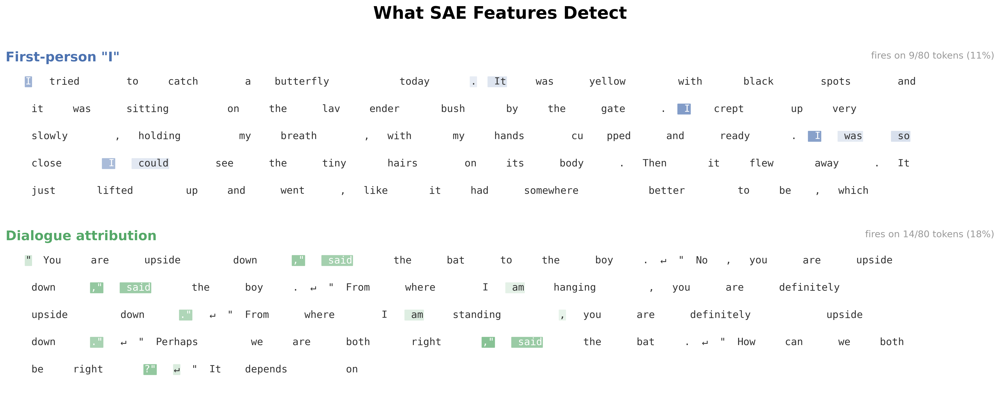
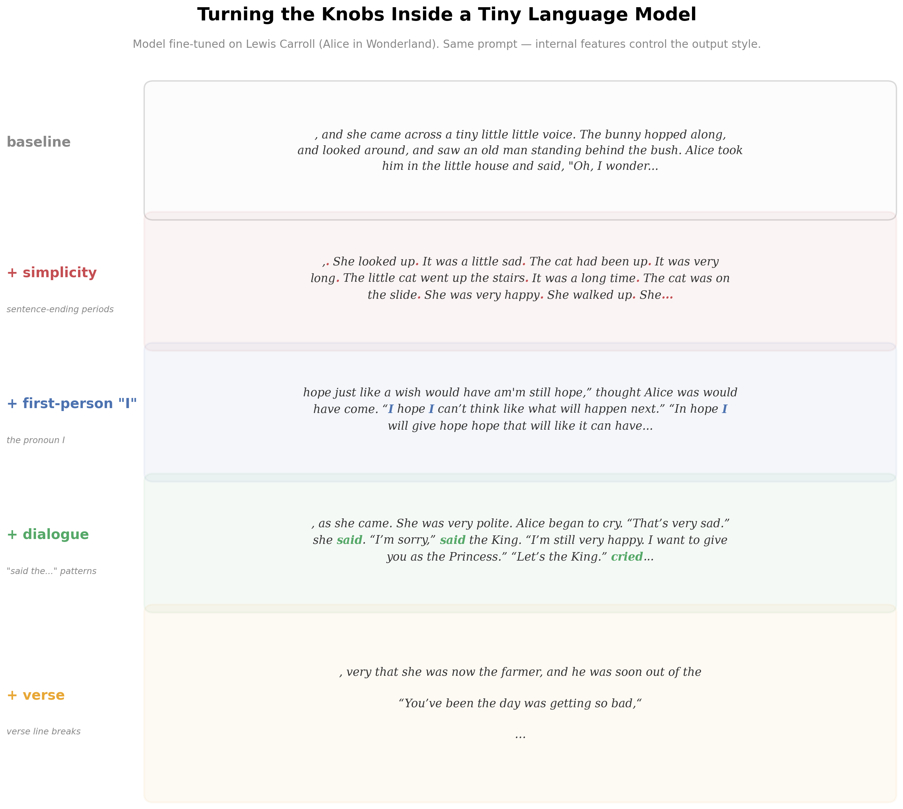
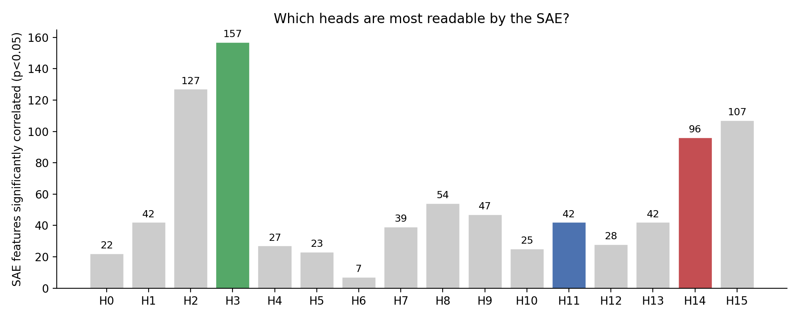
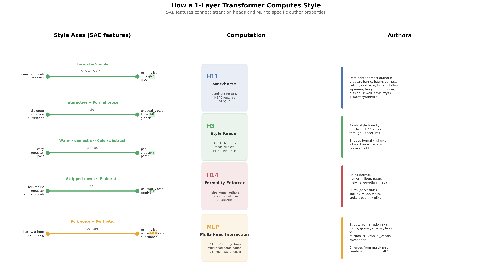

# Experiment in a Pocket: Opening a Tiny Model and Finding the Knobs

The model: [TinyStories-1Layer-21M](https://huggingface.co/roneneldan/TinyStories-1Layer-21M) — one transformer layer, 16 attention heads, 21 million parameters. Trained to generate children's stories. I fine-tuned it with 77 LoRA adapters (one per author style) and ran everything on CPU. The [previous experiment](ARTICLE_SIMPLE.md) found three attention heads that carry most of the style — but knowing *which* heads matter doesn't tell you *what* they compute. I wanted to see inside.

---

## What's inside a transformer?

At each token, the model builds up a vector — a long list of numbers — that encodes everything it knows about what comes next. Attention heads read patterns from context, the MLP transforms them. By the final layer, style and content are tangled together in this vector. You can't just look at dimension 47 and say "that's formality."

A **sparse autoencoder** (SAE) untangles it. It learns directions in that space where each one corresponds to a recognizable pattern — a *feature*. Most features are off for any given token; only a few fire at once. That sparsity forces each one to mean something specific. Anthropic used this approach to find the famous "Golden Gate Bridge" feature inside Claude [5]. I used it on a much smaller model.

---

## How I labeled the features

The labels had to be grounded, not guessed. So I built synthetic training authors before the SAE existed — each one isolating exactly one property:

> **Minimalist:** *"A cat sat. It saw a bird. The bird flew. The cat watched. Then it slept."*
>
> **Dialogue:** *"Are you going to eat me?" asked the rabbit. "I have not decided yet," said the fox.*
>
> **Cozy:** *"The kitchen smelled of cinnamon and warm bread and honey. Grandmother stood at the stove, stirring a big pot of soup with a wooden spoon."*

Then: train the SAE, check which features correlate with which synthetic author, cross-check against the actual tokens that fire. Only label when both agree. My first attempt — labeling from real author profiles alone — produced labels that didn't survive testing. The synthetics fixed that. (Full pipeline in the [methodology doc](METHODOLOGY_SAE.md).)

---

## What the SAE found

Out of 2048 features, 314 are alive. A larger SAE or longer training would likely recover more. But more features wouldn't change what the model *knows*: a 21M single-layer model simply doesn't have deep concept representations to decompose. The alive features already capture the structure that exists. Most arrange along one dominant axis: formal/elaborate on one end, simple/interactive on the other. My goal wasn't the best SAE — I wanted to find meaningful directions, and 314 turned out to be enough.

Only about 25 features fire on a recognizable, human-interpretable concept — far fewer than Anthropic's SAE papers report. But this model is far from Claude: 21M parameters vs. hundreds of billions. A TinyStories model may genuinely not have more than 25 distinct stylistic concepts to decompose. (Full breakdown in the [monosemanticity audit](MONOSEMANTICITY_AUDIT.md).)

The features split into two kinds. **Structural features** control syntax — sentence length, punctuation, line breaks. **Semantic features** detect content — atmosphere, food descriptions, character voices. The SAE decomposes them more finely than my designed labels: three separate features for "cozy" alone — food descriptions, color/texture, and tactile warmth. Not one "cozy" concept, but three sub-concepts.

**What makes an author an author?** Not individual features. Most real authors' signatures live in distributed patterns across function words and punctuation — the kind of thing this model can't cleanly decompose. The rich, interpretable features mostly belong to synthetic styles, not real authors. What the SAE *does* reveal is universal structural knobs — simplicity, dialogue, first-person — that reshape each adapter's output differently. The same simplicity direction produces different simplified text for Poe vs Carroll vs Grimm. The adapter is the identity; the features are the controls.

---

## Steering: turning the knobs

Each feature is a direction in the residual stream. Adding it during generation nudges the model. But does the nudge actually produce what the label says?

**Poe + simplicity** — gothic prose stripped to bare bones:

> **Baseline:** *"and the trees began to have to stop him from his bed. The dark and sky wept. The dark sky above the clouds seemed to go away"*
>
> **Steered:** *"It was dark. I went to sleep. It was dark. I woke up. It was dark. We could find a car. It was dark and it was night."*

Sentence length drops from 24 to a few words. Works on every seed. The same knobs work on Carroll — four features, same prompt, different effects:

The same knobs reshape each author's voice differently. Sometimes the effect is immediate at a small scale. Sometimes it's subtle and needs a stronger push. **What breaks:** Poe + dialogue degenerates ("spirit spirit spirit"). Steering works best as contrast — moving an author *away* from their natural voice.

Features also compose. Individually, questions, dialogue, and simplicity each produce subtle effects on the base model. Combined, they create a coherent voice:

> **Baseline (base model):** *"She loved to run, jump, and play like a ball. One day, she was playing in the park when she saw an empty swing."*
>
> **Steered (questions + dialogue + simplicity):** *"She asked her mommy, 'Can I go outside and play?' Her mommy said, 'Yes, but you must stay on the swing. There are many other kids there.'"*

Short sentences, dialogue tags, questions — three features, one voice.

### Detection ≠ steering

The SAE finds features that fire exclusively on archaic pronouns — "thou," "thee," "thy." They light up on Blake and Milton, barely fire on modern prose. Textbook monosemantic detectors.

But injecting these directions during generation produces nothing archaic. No "thou," no "thee." The model degenerates before producing a single archaic pronoun. Perfect detectors, useless steering vectors.

The same for the "Marilla" detector — it fires precisely on "Mar" and "illa" subtokens in Montgomery's text. But injecting its direction never produces "Marilla." At moderate scales, the model shifts toward "Mar-" prefixed names like "Mary." At high scales, it collapses into repeating subtokens. The feature is read-only.

Why? Compare with Anthropic's Golden Gate Bridge experiment [5], where clamping one feature made Claude unable to stop talking about the bridge. The difference is model capacity: Claude has billions of parameters and "Golden Gate Bridge" deep in its training distribution. TinyStories has 21M parameters. Even LoRA-adapted Blake can't be pushed to produce "thou" — the base model's vocabulary doesn't have strong enough logits for it. **Steering amplifies what the model can already express.**

Structural features (sentence length, punctuation) steer almost universally. Semantic features (atmosphere, character voice) only steer with the right adapter — the adapter shifts probability mass toward those tokens, and the feature pushes further. Same vocabulary, different learned weights.

---

## What the heads were doing all along

The [previous article](ARTICLE_SIMPLE.md) found *which* heads matter. Now the SAE tells us *what* they read.

The 16 heads form three clusters. Four heads share the same landscape: vocabulary register and conversational tone, with 30–50% feature overlap between them. Five more form a looser cluster around idiosyncratic patterns. The rest are minor.

But the interesting part is the individual stories:

**H14 is the one we can explain end-to-end.** It suppresses first-person "I" and conversational verbs. It amplifies rare vocabulary. Authors who narrate from the outside — Homer, Milton, Melville — benefit. Authors who narrate from the inside — Shelley's first-person Frankenstein, Stoker's diary-entry Dracula — get hurt. We can trace this from SAE features all the way to word-level statistics in the training text.

**H11 is the one we can't.** It dominates style for most authors, and the SAE does find features it correlates with — but those features share zero overlap with any other head, and no text-level property predicts H11's effect. Whatever it reads, it reads alone, and we can't measure it by counting words.

**Some features are invisible to all heads.** The strongest is a simplicity direction — no attention head controls it. It emerges from how the MLP transforms the combination of multiple heads' outputs. You can't find it with knockout experiments. Activation steering reaches it every time.

---

## What I learned

**Three heads and an MLP — that's the whole model.** H11 carries style for most authors, H3 reads every interpretable axis, H14 separates conversational prose from elevated register. The MLP creates emergent directions that no single head controls.

**Style has two layers.** Shared structural knobs that steer on any model, and semantic directions that only amplify with the right adapter.

**The strongest style direction is invisible to heads.** It lives in the MLP. No knockout experiment can find it.

**LoRAs amplify — they don't create.** Almost all features in any adapted model already exist in the base model. Style is latent. Fine-tuning selects and reshapes.

**Steering amplifies what the model can already express.** Structural features work universally. Archaic pronouns and character names fail because TinyStories can't produce them. On a bigger model, more features would steer — that's a testable prediction.

Anthropic's recent paper [6] shows this is already happening at scale. They extract emotion directions — "desperate," "calm," "curious" — from Claude's activations and steer behavior causally. Amplifying "desperate" increases reward-hacking. Reducing "calm" does the same. On a model that large, semantic features steer universally without needing per-style adapters.

For exact numbers, statistical tests, and the complete feature catalog, see the [technical report](TECHNICAL_REPORT_SAE.md).

---

All code, data, and experiments: [github.com/moudrkat/sixteen-voices](https://github.com/moudrkat/sixteen-voices)

Previous article: [Sixteen Voices](ARTICLE_SIMPLE.md)

---

## References

[1] T. Bricken et al., ["Towards Monosemanticity"](https://transformer-circuits.pub/2023/monosemantic-features), Anthropic, 2023.

[2] H. Cunningham et al., ["Sparse Autoencoders Find Highly Interpretable Features in Language Models"](https://arxiv.org/abs/2309.08600), ICLR 2024.

[3] L. Gao et al., ["Scaling and Evaluating Sparse Autoencoders"](https://arxiv.org/abs/2406.04093), 2024.

[4] A. Turner et al., ["Activation Addition: Steering Language Models Without Optimization"](https://arxiv.org/abs/2308.10248), 2023.

[5] A. Templeton et al., ["Scaling Monosemanticity"](https://transformer-circuits.pub/2024/scaling-monosemanticity/), Anthropic, 2024.

[6] Anthropic, ["How Emotion Concepts Function in an AI Model"](https://www.anthropic.com/research/emotion-concepts-function), 2025.

For the full reference list including TinyStories, LoRA, and related work, see the [technical report](TECHNICAL_REPORT_SAE.md).