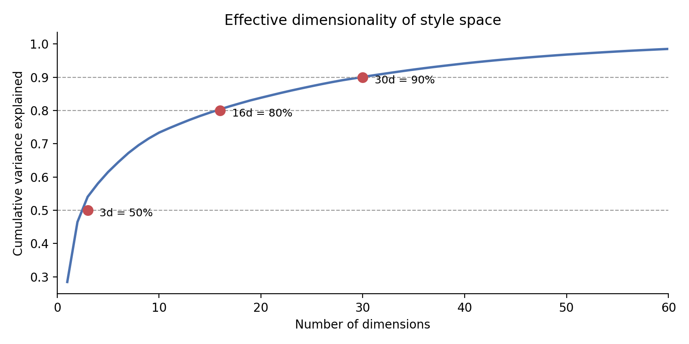
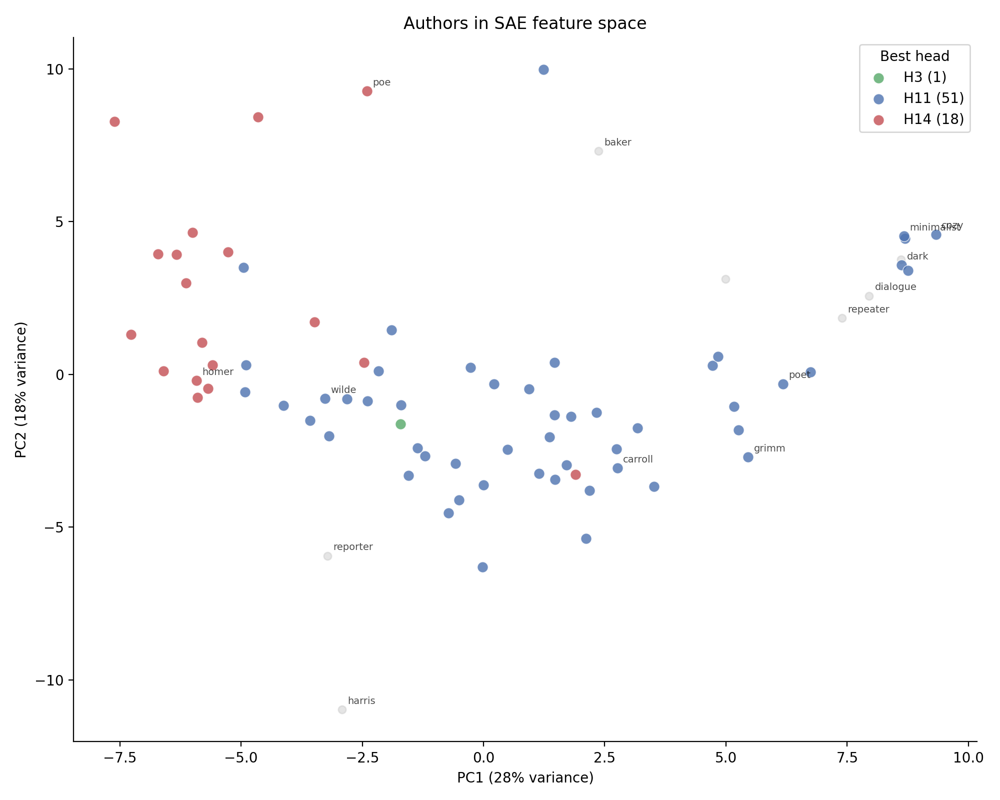

# Opening the Heads: SAE Features on a Tiny Transformer

In the [previous experiment](ARTICLE_SIMPLE.md), I trained 77 LoRA adapters on a tiny 1-layer transformer — one per author or style — and asked which attention heads matter. Three stood out: H11 (dominant for 66% of authors), H14 (polarizing — helps some, hurts others), H3 (consistent second). But knowing *which* heads matter doesn't tell you *what* they compute. I needed to look inside the residual stream.

Same setup: TinyStories-1Layer-21M [4], 77 LoRA [5] adapters (69 real authors + 8 synthetic styles), laptop CPU.

---

## Step 1: Looking inside the residual stream

A transformer builds up a representation at each token position — a 1024-dimensional vector called the residual stream. Each layer adds information to it: attention heads read patterns, the MLP transforms them. By the end, this vector contains everything the model knows about what token comes next.

The problem: all 1024 dimensions are active at once, and individual dimensions don't mean anything on their own. It's like hearing 1024 instruments playing simultaneously — you can't pick out the melody.

A **sparse autoencoder** (SAE) [1][8] is a tool that listens to this cacophony and finds individual melodies. It works in three steps:

1. **Compress**: project the 1024-dim vector into 256 "features" using a learned linear map, then zero out anything below zero (ReLU). Most features end up at zero for any given token — only a few "fire" at once. That's the sparsity.

2. **Reconstruct**: use another linear map to rebuild the original 1024-dim vector from just the active features.

3. **Train**: adjust both maps to minimize reconstruction error, plus a penalty for having too many features active at once. The penalty is the key — it forces each feature to capture something distinct, rather than spreading information across many features.

After training, each feature is a direction in the 1024-dim space. When feature 198 fires strongly on a token, it means the residual stream at that position points strongly in that direction. The question is: what does that direction *mean*?

I used 256 features on a 1024-dim space — fewer features than dimensions. Standard practice uses more features than dimensions (overcomplete) [1][2], but on this tiny model that didn't produce sparse features — consistent with the observation that feature quality degrades on smaller models [8]. The bottleneck forces features to specialize, which is what we want.

---

## Step 2: What fires on what?

I ran all 77 authors' eval texts through the base model and collected the SAE feature activations — a 77 x 256 matrix: how strongly each feature fires for each author, on average.

First finding: **most of the variation is low-dimensional.** 50% of all style variance across 77 authors collapses into just 3 directions. 80% into 15. The adapters aren't 77 independent styles — they're variations on a few themes.



Then I tried to label the features. The first attempt was incomplete, and the path to getting it right taught me something about methodology.

### Author profiles: the first step, not the last

My first approach: look at which authors score high or low on each feature and assign a conceptual label. Feature 2 is high for Homer and Poe, low for minimalist and dialogue — call it "complexity." Feature 198 is high for Harris and Grimm, low for minimalist — call it "conventional structure."

The author profiles are real data — f198 genuinely separates Harris/Grimm from minimalist. But the conceptual labels I jumped to ("complexity", "conventional") were abstractions that **didn't survive quantitative testing**. When I steered with "complexity," text changed but not in ways that matched "more complex" by any metric. The author profile was right; my interpretation of it was too loose.

### Tokens and synthetics: the full picture

What completed the picture: checking which **tokens** each feature fires on, then validating against the **synthetic styles** I designed as controls.

The synthetic styles are the key methodological tool. Each one isolates a single property: *minimalist* (short choppy sentences), *dialogue* (all conversation), *firstperson* (first-person narration), *cozy* (warm domestic), *unusual_vocab* (rare words), *repeater* (rhythmic repetition), *questioner* (asks lots of questions), *reporter* (factual statements). I designed them specifically so that when a feature correlates with one, I know what property it's detecting.

For each feature, I check three things:
1. **Which tokens fire it most?** (what does it literally detect?)
2. **Which synthetic styles score high or low?** (which designed property does it correlate with?)
3. **Do the tokens and the synthetics tell the same story?**

When all three agree, I trust the label.

---

## Step 3: The features we found

Here are the features that passed all three checks — tokens, synthetics, and author profiles tell a consistent story:

**f68 — Direct speech.** Fires on: "I", "you", "why would I", "cannot", "we both". Synthetics: dialogue(+2.4σ), firstperson(+2.0σ), questioner(+1.9σ). Real authors high: Norse, Burgess, Grimm. Low: Lovecraft, Gibbon, Browne. This feature detects first-person and second-person address — characters talking to each other or to the reader.

**f122 — Speech attribution.** Fires on: "said the owl", "said the boy", speech-end punctuation. Synthetics: dialogue(+1.6σ), minimalist(+1.2σ). Real authors high: Arabian, Grahame, Harris. Low: Carlyle, Gibbon, Poe. Detects the "he said / she said" patterns that mark dialogue in narration.

**f198 — Structured narration.** Fires on: narrative scaffolding tokens, line breaks between clauses, Harris dialect transitions. Synthetics low: minimalist(-2.5σ), questioner(-2.4σ), cozy(-2.2σ). Real authors high: Harris, Russian, Grimm, Lang. This feature detects text with narrative structure — the connective tissue between events. It's highest for folk/fairy-tale authors who build long narrative chains, lowest for choppy or interactive styles. **Head-independent** — no attention head controls it (max |r| = 0.25).

**f33 — Clause complexity.** Fires on: mid-sentence connectors ("of", "see", "much", "especially"), function words inside complex constructions. Synthetics low: minimalist(-3.6σ!), unusual_vocab(-2.0σ), cozy(-1.8σ). Real authors high: Harris, Barrie, Lang, Tennyson. The strongest anti-minimalist feature — it detects everything that minimalist sentences don't have: subordinate clauses, prepositional chains, embedded structure. **Head-independent** (max |r| = 0.18, the lowest of any high-variance feature).

**f160 — Referential continuity.** Fires on: "so", "Alice", "people", "and", "might" — tokens that refer back to established context. Synthetics low: minimalist(-3.4σ), unusual_vocab(-2.5σ), dialogue(-1.6σ). Real authors high: Japanese, Russian, Lang, Grimm. Detects text where sentences build on each other — the "so" that connects cause to effect, the proper nouns that maintain character continuity.

**f144 — Embedded clauses.** Fires on: commas inside complex clauses, "for", "near", "though" — mid-sentence tokens that signal subordination. Synthetics low: questioner(-3.7σ), firstperson(-2.5σ), dialogue(-2.4σ). Real authors high: Grahame, Harris, Twain, Collodi. The opposite of direct, question-driven text.

**f147 — Warm/rhythmic.** Fires on: scene-ending tokens, domestic settings. Synthetics: cozy(+2.8σ), repeater(+2.6σ), poet(+2.1σ). Real authors high: Indian, Japanese, Carroll. Low: Poe, Gibbon, Shelley. The cozy-fireplace direction.

**f113 — Short declarative sentences.** Fires on: sentence boundaries (periods), short independent clauses. Synthetics: minimalist(+2.4σ), reporter(+2.3σ). The minimalist's signature — short, complete, end-stopped.

Most features aren't independent — they're variations of one dominant axis: **formal/elaborate vs simple/interactive**. The SAE found this axis ~20 different ways. But the features above represent the genuinely distinct directions: direct speech (f68), speech attribution (f122), structured narration (f198), clause complexity (f33), referential continuity (f160), embedded clauses (f144), warm/rhythmic (f147), and short sentences (f113).



*Authors in SAE feature space, colored by their dominant head from knockout experiments.*

---

## Step 4: Connecting features to heads

The [previous article](ARTICLE_SIMPLE.md) found which heads matter. The SAE tells us what each head reads — by correlating every feature with every head's knockout recovery score, a simplified version of the feature circuit analysis in [9]. After Bonferroni correction for 4,096 tests:


**H3 has 37 features.** The formal/simple axis, the speech features, the warm/domestic direction — H3 touches all of them. It's the general-purpose style reader.

**H11 has zero features.** It dominates style for 66% of authors, but the SAE can't decompose what it does into independent features. It works through a few concentrated directions — powerful but opaque.

**H14 is the formality enforcer.** The previous article found H14 helps some authors and hurts others — without explaining why. The SAE reveals the mechanism: H14 anti-correlates with the interactive features (f113: minimalist+2.4σ, r=-0.49; f122: dialogue+1.6σ, r=-0.46; f68: dialogue+2.4σ, r=-0.38). H14 pushes the model toward formal prose. Authors who already write formally benefit: Homer (+0.73), Melville (+0.71), Milton (+0.68), Pater (+0.67). Authors whose style is accessible or emotional get hurt: Shelley (-0.68), Wilde (-0.34), Wells (-0.34). H14 fights their natural register.

**f33 and f198 are head-independent.** No attention head correlates with them (max |r| = 0.18 and 0.25). These features separate structured narration (Harris, Grimm, Lang) from minimalist/synthetic styles, but no single head drives this separation. Modifying attention weights in one direction (LoRA weight steering) can't move them either — 49%, coin flip.

Where does this axis come from? In a 1-layer model, the residual stream is: embedding + all 16 heads + MLP(everything). The LoRA adapters only modify attention — the MLP is identical across all 77 authors. So the variation must ultimately originate in attention. But f33 doesn't track any single head, and a single weight-steering direction can't reach it. The most likely explanation: this axis emerges from how the MLP *nonlinearly transforms* the combination of multiple heads' outputs — a pattern that no individual head produces but that the MLP amplifies. Like a flavor in cooking that only appears after baking, not from any single ingredient.


*SAE features connect attention heads to specific author properties. Green axes are read by H3. The orange axis (structured narration) doesn't track any single head — it emerges from multi-head interactions through the MLP.*

| Head | Knockout role | SAE features | Which authors | What it does |
|---|---|---|---|---|
| **H11** | Dominant (66%) | 0 after Bonferroni | Almost everyone | Concentrated power; SAE can't decompose it |
| **H3** | Consistent second | 37 features | All — reads everything | General-purpose style reader |
| **H14** | Polarizing (23%) | 1 after Bonferroni | Helps Homer/Milton; hurts Shelley/Wilde | Formality enforcer |
| **H2** | Minor in knockout | 5 features | Specific | Hidden role revealed by SAE |
| **MLP interaction** | Invisible to knockout | f33, f198 | Harris/Grimm vs minimalist | Emerges from multi-head combination, no single head drives it |

---

## Step 5: Steering

Each SAE feature is a direction in the residual stream. Adding that direction during generation — activation steering [6] — nudges the model's next-token predictions. But does the nudge do what the feature label says?

I tested this with a **closed-loop validation**: steer with a feature, generate text, run the generated text through the SAE on an **unsteered** base model, and check whether the targeted feature actually increased. If the steered text genuinely contains more of what the feature detects, the feature's activation should go up — even when measured by a clean model that doesn't know about the steering.

Three feature groups pass (83-87% of the time, vs ~45% for random features):

| Feature group | Targeted UP | Other UP | Selective? |
|---|---|---|---|
| **Structured narration** (f198, f33, f140) | 87% | 40% | Yes |
| **Referential/embedded** (f160, f144, f205) | 87% | 47% | Yes |
| **Direct speech** (f68, f113, f122) | 83% | 43% | Yes |

The text effects are visible and reproducible across seeds:

**Grimm + structured narration** — fairy-tale structure amplifies consistently:

> **Baseline:** *"a little girl in the countryside, and she was very excited, and would often come out in a meow"*
>
> **Steered (s=42):** *"a little girl in the countryside who loved to ride on the horse, and the horse trots around the meadows"*
>
> **Steered (s=123):** *"a little girl called Lily. Lily had an old wise grandmother who said, 'Go to my little sister, dear'"*
>
> **Steered (s=456):** *"a little old prince who had a big heart, and had been given his soul to his own heart"*

Every seed: meadows, grandmothers, princes. The narrative scaffolding that f198 detects (folk-tale transitions, structured clauses) manifests as fairy-tale motifs in Grimm's output.

**Dark + referential/embedded** — static atmosphere gains action:

> **Baseline:** *"A cat was inside a house, wet and it was cold. The cat was not normal."*
>
> **Steered (s=42):** *"the trees were shaking in the wind, they heard the loud noise once again, they looked around, trying to find an exit"*

Characters hearing, looking, trying. The referential continuity features (f160: "so", "people", causal connectors) turn static description into sequential action.

**Poe + direct speech** — gothic third-person becomes first-person address:

> **Baseline:** *"the whole sky was in hot air, but the whole sky above and sky wept"*
>
> **Steered (s=42):** *"I was not sure I had not, I, to see you closely and I gave you it, if you ever give me your hand"*

The "I/you" pattern that f68 detects (dialogue+2.4σ, firstperson+2.0σ) turns Poe's detached gothic into frantic direct address.

**What doesn't work:** Poe degenerates with structured narration ("spirit spirit spirit") — the folk-tale direction pushes Poe too far from its register. Steering works best when the author's natural voice is distant but compatible with the feature direction.

---

## Step 6: Why weight steering fails (and what that proves)

I also tried modifying LoRA weights along feature directions — a form of task arithmetic [7], averaging high-scoring authors' weight deltas, subtracting low-scoring ones, adding the difference to any adapter. This doesn't work: targeted features go up only 49% of the time (coin flip).

The diagnostic revealed **which** features actually move when you modify attention weights: f233, f102, f67 — all H3-correlated features. The targeted structured-narration features (f198, f33) barely budge. The weight direction is too blunt — it captures everything that differs between high and low authors, not just the targeted property.

But the deeper finding: **the structured narration features don't track any single head, and a single-direction weight modification can't reach them.** Since the MLP is identical across all authors, the variation originates in attention — but in a nonlinear multi-head combination that the MLP transforms, not in any individual head. Activation steering bypasses this entirely by adding vectors directly to the residual stream.

This adds causal evidence to the statistical observation: the SAE found features orthogonal to all heads (correlation), and weight steering showed that a single attention-weight direction can't move them (intervention). The structured narration axis is real, and it emerges from the model's computation in a way that no single head controls.

---

## What we found

**The model computes style through three mechanisms:**

**H11** does the heavy lifting for most authors — but through concentrated, opaque directions that the SAE can't decompose. It's the power tool.

**H3** reads the interpretable style landscape — formal vs simple, direct speech vs narrated, warm vs cold. 37 features, touching everything. It's the Swiss army knife.

**H14** enforces formality — pushing toward rare vocabulary and away from interactive speech. This explains its polarization from the [first article](ARTICLE_SIMPLE.md): Homer and Milton benefit because they're already formal. Wilde and Shelley get hurt because H14 fights their natural register.

**One axis emerges from multi-head interactions** that no single head controls: structured narration vs minimalist simplicity. Harris, Grimm, and Lang on one end; minimalist, questioner, and unusual_vocab on the other. Invisible to single-head knockout, discoverable only through the SAE. The MLP likely amplifies this multi-head pattern, but the variation ultimately originates in attention.

**The features are real but shallow.** They detect word-level patterns — clause boundaries, speech markers, referential connectors — not abstract "style." But those patterns track author identity well, they're validated against designed synthetic controls, and they steer reproducibly. On a 21M-parameter children's story model, that's the level of structure you get.


---

## Try it yourself

```bash
# Train SAE + analyze
uv run python scripts/train_sae.py --n-features 256
uv run python scripts/analyze_sae.py
uv run python scripts/analyze_sae_features.py

# Steer from command line
uv run python scripts/steer_sae_features.py --author grimm --features 198:+5 33:+5

# Interactive app
streamlit run demos/app_features.py
```

Previous article: [Sixteen Voices](ARTICLE_SIMPLE.md)

---

## References

[1] T. Bricken et al., ["Towards Monosemanticity"](https://transformer-circuits.pub/2023/monosemantic-features), Anthropic, 2023.

[2] A. Templeton et al., ["Scaling Monosemanticity"](https://transformer-circuits.pub/2024/scaling-monosemanticity/), Anthropic, 2024.

[3] N. Elhage et al., ["A Mathematical Framework for Transformer Circuits"](https://transformer-circuits.pub/2021/framework/index.html), Anthropic, 2021.

[4] R. Eldan and Y. Li, ["TinyStories: How Small Can Language Models Be and Still Speak Coherent English?"](https://arxiv.org/abs/2305.07759), 2023.

[5] E. J. Hu et al., ["LoRA: Low-Rank Adaptation of Large Language Models"](https://arxiv.org/abs/2106.09685), ICLR 2022.

[6] A. Turner et al., ["Activation Addition: Steering Language Models Without Optimization"](https://arxiv.org/abs/2308.10248), 2023.

[7] G. Ilharco et al., ["Editing Models with Task Arithmetic"](https://arxiv.org/abs/2212.04089), ICLR 2023.

[8] H. Cunningham et al., ["Sparse Autoencoders Find Highly Interpretable Features in Language Models"](https://arxiv.org/abs/2309.08600), ICLR 2024.

[9] S. Marks et al., ["Sparse Feature Circuits: Discovering and Editing Interpretable Causal Graphs in Language Models"](https://arxiv.org/abs/2403.19647), 2024.
