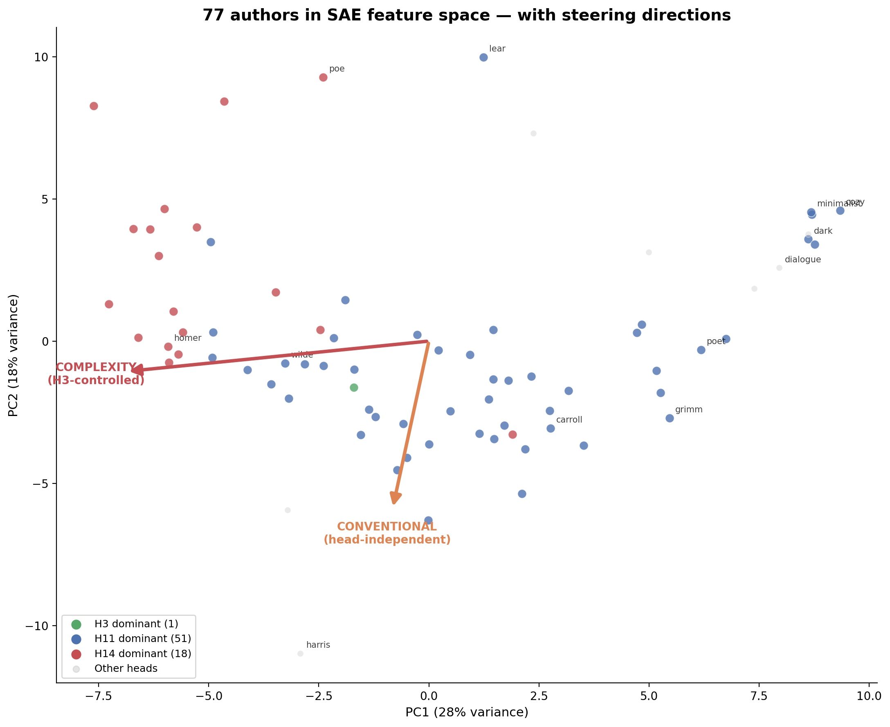

# Opening the Heads: SAE Features on a Tiny Transformer

The [previous experiment](ARTICLE_SIMPLE.md) found three attention heads that carry most of the style: H11 (dominant for 66% of authors), H14 (polarizing — helps some, hurts others), H3 (consistent second). But knowing *which* heads matter doesn't tell you *what* they compute. I wanted to see inside.

---

## Looking inside the residual stream

A transformer builds up a representation at each token position — a 1024-dimensional vector called the residual stream. Each layer adds information to it: attention heads read patterns, the MLP transforms them. By the end, this vector contains everything the model knows about what token comes next.

The problem: individual dimensions don't mean anything on their own. The model uses distributed representations — concepts are spread across many dimensions, mixed together. You can't read off "this dimension encodes formality" because formality lives in a pattern across hundreds of dimensions, tangled with everything else.

A **sparse autoencoder** (SAE) [1][2][3] learns to decompose this mixed signal into **features** — directions in the space where each one corresponds to a recognizable pattern. Most features are inactive for any given token; only a few "fire" at once. That sparsity forces each feature to capture something specific.

---

## The pipeline

The approach has a specific order, and the order matters:

1. **Design synthetic styles** — *minimalist*, *dialogue*, *questioner*, *cozy*, and others, each isolating one property. These exist before the SAE.
2. **Train the SAE** on the base model's residual stream — running all 77 authors' + synthetic texts through the unadapted model and collecting activations.
3. **Label features with synthetics** — which features correlate with which control? Cross-check with the actual tokens that fire each feature. Only label when both agree.
4. **Connect to heads** — correlate features with knockout scores from the first experiment.
5. **Steer and measure** — inject feature directions during generation, measure text properties across 20 seeds.

The synthetics are the key — they existed before the SAE, so the labels are grounded. Here's what they sound like:

> **Minimalist:** *"A cat sat. It saw a bird. The bird flew. The cat watched. Then it slept."*
>
> **Dialogue:** *""Are you going to eat me?" asked the rabbit. "I have not decided yet," said the fox. "What do you think I should do?""*
>
> **Questioner:** *"Have you ever wondered why the sky is blue? Why is it not green? Why is it not purple? Does the sky change its mind?"*
>
> **Cozy:** *"The kitchen smelled of cinnamon and warm bread and honey. Grandmother stood at the stove, stirring a big pot of soup with a wooden spoon."*

Each isolates one property. When a feature correlates with "questioner" and its top tokens are question marks, I know what it detects.

My first attempt, labeling from author profiles alone, produced labels like "complexity" that didn't survive testing. The author profiles were real data; my abstractions were too loose. The synthetics fixed that.

---

## What the SAE found

I found 314 alive features — the rest are dead, which means the model only needs about 300 directions to represent style. Most features arrange along one dominant axis: formal/elaborate on one end, simple/interactive on the other. 90% of the variance lives in just 9 dimensions.

But within that space, the features split into two kinds. 


**Structural features** control syntax — sentence length, punctuation, line breaks, question marks. There are only about a dozen of these, but they're the ones you can steer with. 

**Semantic features** detect content — dialect, atmosphere, food descriptions, character voices. There are hundreds, and they're what make each author unique.

What do semantic features actually look like? The SAE finds surprisingly specific patterns:

*"not quite a smile and not quite a frown"* — dark's uncanny negation feature.
*"looking in, looking in, looking in, searching"* — dark's obsessive observation.
*"steam rose from the meat and the potatoes were crisp"* — cozy's food feature.
*"wool soft against her fingers"* — cozy's tactile comfort. A different feature from the food one.
*"purring, not growling," said Alice* — Carroll's Wonderland dialogue.

Three separate features for "cozy" alone — food, color, tactile warmth. The SAE decomposes the concept more finely than my designed label.

**Every author is primarily semantic.** Harris has zero elevated structural features and forty semantic ones. Carroll: zero structural, thirteen semantic. What makes an author unique isn't sentence length — it's content. No head specializes in one type or the other — both structural and semantic features flow through the same heads.

---

## Steering

Each feature is a direction in the residual stream. Adding it during generation — activation steering [4] — nudges the model. But does the nudge actually produce what the label says?

**Poe + simplicity** — gothic prose stripped to bare bones:

> **Baseline:** *"and the trees began to have to stop him from his bed. The dark and sky wept. The dark sky above the clouds seemed to go away"*
>
> **Steered:** *"It was dark. I went to sleep. It was dark. I woke up. It was dark. We could find a car. It was dark and it was night."*

Average sentence length: 23.9 → 4.9 words. 20/20 seeds.

**Grimm + dialogue** — fairy-tale narration fills with conversation:

> **Steered:** *"a little frog. The frog loved to bounce... the girl said, 'I have to go to the pond!' So the girl asked her father"*

**Grimm + questions** — fairy tales become interrogative:

> **Steered:** *"'It is like a little frog?' 'I want to be that?' said the frog, 'I go to the mill??'"*

The SAE also learned to distinguish three types of newline — verse line breaks, paragraph breaks, and chapter headings. Same character in the text, three different features.

**What breaks:** Poe + dialogue degenerates ("spirit spirit spirit"). Steering works best as contrast — moving an author *away* from their natural voice.

**Structural features steer universally.** Simplicity and complexity: 100% win rate across 20 seeds. Dialogue: 75%. They work on any model.

**Semantic features only steer with the right adapter.** Injecting cozy features into the cozy adapter: *"She stirred and stirred and stirred, and the cat smelled the cake and the pots."* Same features on the base model: nothing. The adapter has the vocabulary primed; the features push further along that direction. The base model doesn't have "cozy" words weighted up, so there's nothing to amplify.

You can also **compose** structural features: questions + dialogue + simplicity together produce a conversational-questioning voice that no single feature captures.

**One thing that doesn't work:** modifying LoRA weights along feature directions — task arithmetic [5] — is a coin flip. The head-independent features barely budge. This confirms: the simplicity axis emerges from multi-head interactions that no single weight modification can capture. Activation steering works because it bypasses this, adding vectors directly to the residual stream.

---

## What the heads were doing all along

The [previous article](ARTICLE_SIMPLE.md) found which heads matter. The SAE tells us what they *read*:


**H3 is the Swiss army knife.** Over a hundred features — it reads the formal/simple axis, speech patterns, complexity. Everything interpretable goes through H3.

**H11 is the power tool.** It dominates style for 66% of authors, but the SAE can barely decompose it. It works through concentrated directions rather than a broad readable landscape.

**H14 is the formality enforcer.** This was a mystery in the first article — why does H14 help some authors and hurt others? The SAE reveals the answer: H14 anti-correlates with first-person "I", conversational verbs, and short sentences. It pushes the model toward formal prose. Homer and Milton benefit because they're already formal. Shelley and Wilde get hurt because H14 fights their register. Mystery solved.

**27 features are invisible to individual heads.** The strongest is a simplicity direction — no attention head controls it. It emerges from how the MLP nonlinearly transforms the combination of multiple heads' outputs. Weight steering can't reach it (coin flip). Activation steering can (100% win rate). Three independent lines of evidence that this axis lives in the MLP, not in any head.


---

## So, what did I learn?

**Style has two layers.** Shared structural axes that steer on any model, and unique semantic fingerprints that only amplify with the right adapter. The split lives in the features, not in the heads — every head carries both types.

**The strongest style direction is invisible to heads.** It lives in the MLP. No knockout experiment can find it. Only the SAE does.

**One more question: when you fine-tune the model for Poe, does it learn new representations or just turn up existing ones?** LoRAs amplify — they don't create. 98.8% of features in any adapted model already exist in the base model. Style is latent. Fine-tuning selects and reshapes, it doesn't construct.



For methodology details, statistical choices, and the complete feature catalog, see the [technical report](TECHNICAL_REPORT_SAE.md). For the full pipeline design, see the [methodology doc](METHODOLOGY_SAE.md).

---

## What's next

The first article promised three things: a two-layer model, a hypernetwork, and an SAE. The SAE is this article. The other two are in progress:

- **Hypernetwork.** Can a small network predict LoRA weights from a text sample? If the 77 adapters live on a low-dimensional manifold, a hypernetwork should be able to find it. Work in progress.
- **Two-layer model.** Does the clean head specialization survive when heads can compose across layers? Does the structural-semantic split hold?
- **Bigger models and semantic steering.** On this 21M model, semantic features only steer with the matching adapter. On a bigger model with richer vocabulary, they might steer universally. That's a testable prediction.
- **More synthetic controls.** Each new synthetic is a new lens — each would reveal features I can't currently label.

---

## Try it yourself

```bash
# Train SAE with TopK sparsity
uv run python scripts/train_sae.py --activation topk --k 16 --n-features 2048 --epochs 10 --output outputs/sae_topk16_2048

# Analyze features vs heads
uv run python scripts/analyze_sae.py --sae-dir outputs/sae_topk16_2048
uv run python scripts/analyze_sae_features_v2.py --sae-dir outputs/sae_topk16_2048

# Steer from command line
uv run python scripts/steer_sae_features.py --sae-dir outputs/sae_topk16_2048 --author poe --features 665:+15
uv run python scripts/steer_sae_features.py --sae-dir outputs/sae_topk16_2048 --author grimm --features 1777:+5 689:+5

# Run all steering experiments
uv run python scripts/sweep_sae_steering_topk.py

# Interactive app
streamlit run demos/app_features.py
```

Previous article: [Sixteen Voices](ARTICLE_SIMPLE.md)

---

## References

[1] T. Bricken et al., ["Towards Monosemanticity"](https://transformer-circuits.pub/2023/monosemantic-features), Anthropic, 2023.

[2] H. Cunningham et al., ["Sparse Autoencoders Find Highly Interpretable Features in Language Models"](https://arxiv.org/abs/2309.08600), ICLR 2024.

[3] L. Gao et al., ["Scaling and Evaluating Sparse Autoencoders"](https://arxiv.org/abs/2406.04093), 2024.

[4] A. Turner et al., ["Activation Addition: Steering Language Models Without Optimization"](https://arxiv.org/abs/2308.10248), 2023.

[5] G. Ilharco et al., ["Editing Models with Task Arithmetic"](https://arxiv.org/abs/2212.04089), ICLR 2023.

For the full reference list including TinyStories, LoRA, and related work, see the [technical report](TECHNICAL_REPORT_SAE.md).
