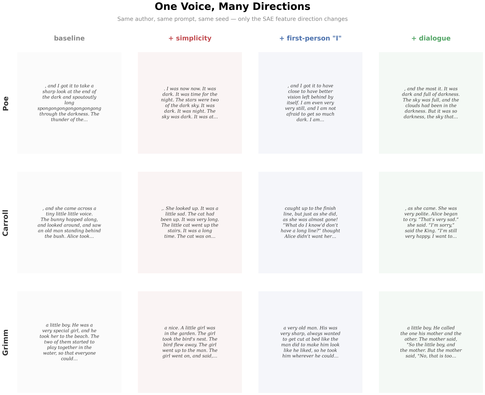

# Opening the Heads: SAE Features on a Tiny Transformer

The [previous experiment](ARTICLE_SIMPLE.md) found three attention heads that carry most of the style — but knowing *which* heads matter doesn't tell you *what* they compute. I wanted to see inside.

---

## Looking inside the residual stream

A transformer builds up a representation at each token position — a 1024-dimensional vector called the residual stream. Each layer adds information: attention heads read patterns, the MLP transforms them. By the end, this vector contains everything the model knows about what token comes next.

The problem: individual dimensions don't mean anything. The model uses distributed representations — concepts are spread across many dimensions, tangled together. You can't read off "this dimension encodes formality."

A **sparse autoencoder** (SAE) [1][2][3] learns to decompose this mixed signal into **features** — directions in the space where each one corresponds to a recognizable pattern. Most features are inactive for any given token; only a few "fire" at once. That sparsity forces each feature to capture something specific.

---

## The pipeline

The approach has a specific order, and the order matters:

1. **Design synthetic styles** — *minimalist*, *dialogue*, *questioner*, *cozy*, and others, each isolating one property. These exist before the SAE.
2. **Train the SAE** on the base model's residual stream.
3. **Label features with synthetics** — which features correlate with which control? Cross-check with the actual tokens that fire. Only label when both agree.
4. **Connect to heads** — correlate features with knockout scores from the first experiment.
5. **Steer and measure** — inject feature directions during generation, measure text properties across 20 seeds.

The synthetics are the key — they existed before the SAE, so the labels are grounded. Here's what they sound like:

> **Minimalist:** *"A cat sat. It saw a bird. The bird flew. The cat watched. Then it slept."*
>
> **Dialogue:** *""Are you going to eat me?" asked the rabbit. "I have not decided yet," said the fox."*
>
> **Cozy:** *"The kitchen smelled of cinnamon and warm bread and honey. Grandmother stood at the stove, stirring a big pot of soup with a wooden spoon."*

Each isolates one property. When a feature correlates with "questioner" and its top tokens are question marks, I know what it detects. My first attempt — labeling from author profiles alone — produced labels that didn't survive testing. The synthetics fixed that.

---

## What the SAE found

Out of 2048 features, 314 are alive. Most arrange along one dominant axis: formal/elaborate on one end, simple/interactive on the other.

Only about 25 features fire on a recognizable, human-interpretable concept — far fewer than Anthropic's SAE papers suggest. But this model is far from Claude: 21M parameters vs. hundreds of billions, 2x SAE expansion vs. 130x. A TinyStories model may genuinely not have more than 25 distinct stylistic concepts to decompose. (Full breakdown in the [monosemanticity audit](MONOSEMANTICITY_AUDIT.md).)


The features split into two kinds. **Structural features** control syntax — sentence length, punctuation, line breaks. There are about a dozen. **Semantic features** detect content — atmosphere, food descriptions, character voices. There are hundreds, and the SAE decomposes them more finely than my designed labels:

*"not quite a smile and not quite a frown"* — dark's uncanny negation.
*"steam rose from the meat and the potatoes were crisp"* — cozy's food feature.
*"wool soft against her fingers"* — cozy's tactile comfort. A different feature from the food one.

Three separate features for "cozy" alone — food, color, tactile warmth.

**What makes an author an author?** Not individual SAE features. Most real authors' signatures live in distributed patterns across function words and punctuation — the kind of thing a 21M-parameter model can't cleanly decompose. The rich, interpretable features mostly belong to synthetic styles, not real authors. What the SAE *does* reveal is universal structural knobs — simplicity, dialogue, first-person — that reshape each adapter's output differently. The same simplicity direction produces different simplified text for Poe vs Carroll vs Grimm. The adapter is the identity; the features are the controls.

---

## Steering

Each feature is a direction in the residual stream. Adding it during generation — activation steering [4] — nudges the model. But does the nudge actually produce what the label says?

**Poe + simplicity** — gothic prose stripped to bare bones:

> **Baseline:** *"and the trees began to have to stop him from his bed. The dark and sky wept. The dark sky above the clouds seemed to go away"*
>
> **Steered:** *"It was dark. I went to sleep. It was dark. I woke up. It was dark. We could find a car. It was dark and it was night."*

Sentence length drops from 24 to 5 words. Works on every seed.

The same knobs reshape each author's voice differently:



**What breaks:** Poe + dialogue degenerates ("spirit spirit spirit"). Steering works best as contrast — moving an author *away* from their natural voice.

### Detection ≠ steering

The SAE finds three features that fire exclusively on archaic pronouns — "thou," "thee," "thy." They light up on Blake and Milton, barely fire on modern prose. Textbook monosemantic detectors.

But injecting all three directions during generation produces nothing archaic. No "thou," no "thee." Milton and Blake degenerate before producing a single archaic pronoun. The features are perfect detectors and useless steering vectors.

Why? Compare with Anthropic's Golden Gate Bridge experiment [5], where clamping one feature made Claude unable to stop talking about the bridge. The difference is model capability: Claude has "Golden Gate Bridge" deep in its training distribution. TinyStories was trained on simple children's stories. Even LoRA-adapted Blake can't be pushed to produce "thou" — the base model's output head doesn't have strong enough logits for it. **Steering amplifies what the model can already express.**

Structural features steer universally — simplicity works on every author, every seed. Semantic features only steer with the right adapter. Injecting cozy features into the cozy adapter: *"She stirred and stirred and stirred, and the cat smelled the cake and the pots."* Same features on the base model: nothing. The adapter has shifted probability mass toward those tokens; the features push further along that direction. Same vocabulary, different learned weights.

You can also compose features: questions + dialogue + simplicity together produce a conversational-questioning voice that no single feature captures.

---

## What the heads were doing all along

The [previous article](ARTICLE_SIMPLE.md) found which heads matter. The SAE tells us what they *read*:


The 16 heads fall into three groups. Four heads — H3, H14, H15, H2 — read the same landscape: vocabulary register and conversational tone. They share many features (30–50% feature overlap) and all correlate with measurable text properties like conversational verb density and average word length. H3 reads the broadest (107 features), H14 acts on it most decisively (dominant for 18 authors). Five more — H0, H4, H8, H9, H12 — form a looser cluster around idiosyncratic style patterns. The remaining heads are minor.

**H14 is the one we can explain end-to-end.** It suppresses first-person "I" and conversational verbs. It amplifies rare vocabulary features. Authors who narrate from the outside in third person (Homer, Milton, Melville) benefit. Authors who narrate from the inside (Shelley's first-person Frankenstein, Stoker's diary-entry Dracula) get hurt. We can trace this from SAE features all the way to word-level statistics in the training text. Sentence length has nothing to do with it.

**H11 is the one we can't.** It dominates style for most authors, and the SAE does find features it correlates with — but those features share zero overlap with any other head, and no text-level property predicts H11's effect. Whatever it reads, it reads alone, and we can't measure it by counting words.

**Some features are invisible to all heads.** The strongest is a simplicity direction — no attention head controls it. It emerges from how the MLP transforms the combination of multiple heads' outputs. Weight steering can't reach it. Activation steering can — every time.


---

## So, what did I learn?

**Three heads and an MLP — that's the whole model.** Out of 16 attention heads, H11 carries style for most authors, H3 reads every interpretable axis, and H14 separates first-person conversational prose from third-person elevated register. The remaining 12 heads are either redundant or minor. The MLP creates emergent style directions — like simplicity — that no single head controls. H14 is the most satisfying: we can trace its effect all the way from SAE features to word-level statistics in the training text. H11 is the most humbling: the SAE shows it reads storytelling patterns, but we can't reduce those patterns to anything as simple as "count the I's."

**Style has two layers.** Shared structural knobs that steer on any model, and semantic directions that only amplify with the right adapter.

**The strongest style direction is invisible to heads.** It lives in the MLP. No knockout experiment can find it.

**LoRAs amplify — they don't create.** Almost all features in any adapted model already exist in the base model. Style is latent. Fine-tuning selects and reshapes.

**Author identity isn't decomposable** — at least not at this scale. The SAE can't tell you "what makes Poe Poe" through individual features. But it can give you universal controls that work across every adapter. Whether a bigger model would yield author-specific features is an open question.

For exact numbers, statistical tests, and the complete feature catalog, see the [technical report](TECHNICAL_REPORT_SAE.md). For the full pipeline design, see the [methodology doc](METHODOLOGY_SAE.md).

---

## What's next

- **Hypernetwork.** Can a small network predict LoRA weights from a text sample? If the adapters live on a low-dimensional manifold, a hypernetwork should find it.
- **Two-layer model.** Does the clean head specialization survive when heads compose across layers?
- **Bigger models.** On this 21M model, semantic features only steer with the matching adapter. On a bigger model, they might steer universally. That's a testable prediction.

---

## Try it yourself

```bash
# Train SAE with TopK sparsity
uv run python scripts/train_sae.py --activation topk --k 16 --n-features 2048 --epochs 10 --output outputs/sae_topk16_2048

# Analyze features vs heads
uv run python scripts/analyze_sae.py --sae-dir outputs/sae_topk16_2048
uv run python scripts/analyze_sae_features_v2.py --sae-dir outputs/sae_topk16_2048

# Steer from command line
uv run python scripts/steer_sae_features.py --sae-dir outputs/sae_topk16_2048 --author poe --features 665:+15
uv run python scripts/steer_sae_features.py --sae-dir outputs/sae_topk16_2048 --author grimm --features 1777:+5 689:+5

# Run all steering experiments
uv run python scripts/sweep_sae_steering_topk.py

# Interactive app
streamlit run demos/app_features.py
```

Previous article: [Sixteen Voices](ARTICLE_SIMPLE.md)

---

## References

[1] T. Bricken et al., ["Towards Monosemanticity"](https://transformer-circuits.pub/2023/monosemantic-features), Anthropic, 2023.

[2] H. Cunningham et al., ["Sparse Autoencoders Find Highly Interpretable Features in Language Models"](https://arxiv.org/abs/2309.08600), ICLR 2024.

[3] L. Gao et al., ["Scaling and Evaluating Sparse Autoencoders"](https://arxiv.org/abs/2406.04093), 2024.

[4] A. Turner et al., ["Activation Addition: Steering Language Models Without Optimization"](https://arxiv.org/abs/2308.10248), 2023.

[5] A. Templeton et al., ["Scaling Monosemanticity"](https://transformer-circuits.pub/2024/scaling-monosemanticity/), Anthropic, 2024.

For the full reference list including TinyStories, LoRA, and related work, see the [technical report](TECHNICAL_REPORT_SAE.md).
