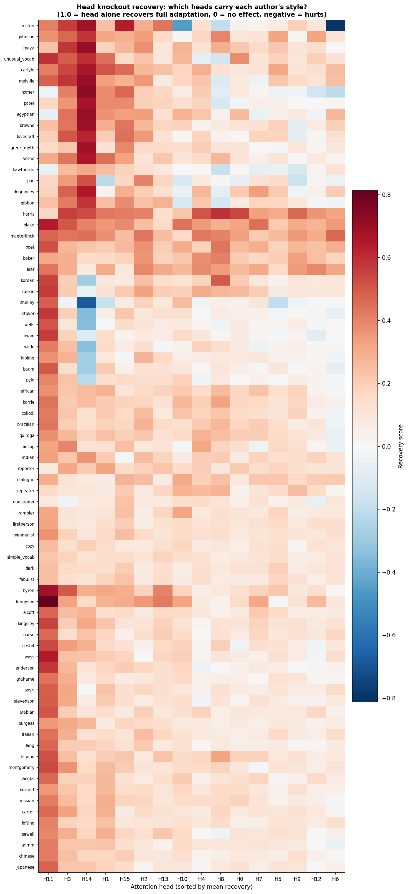
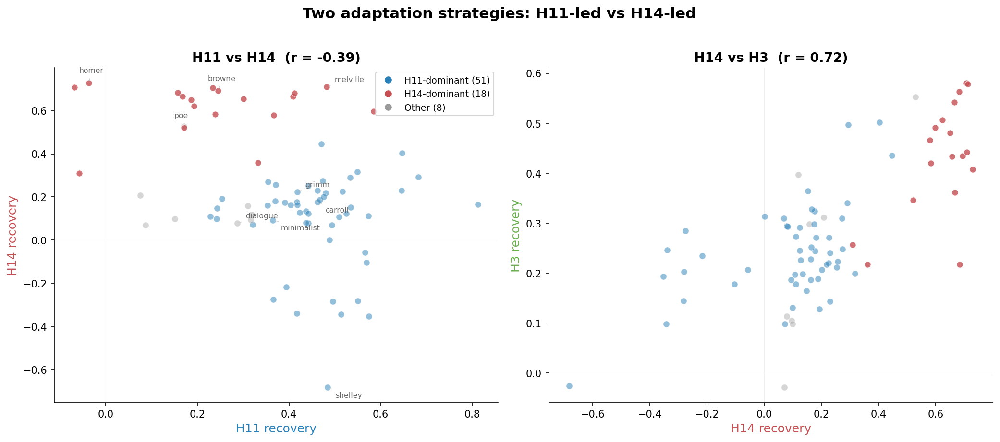
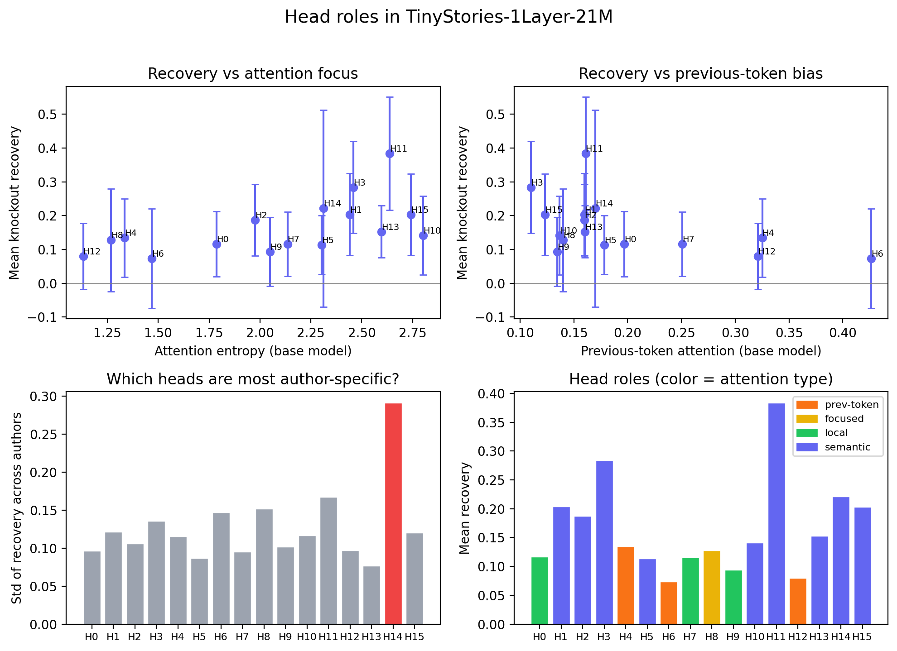
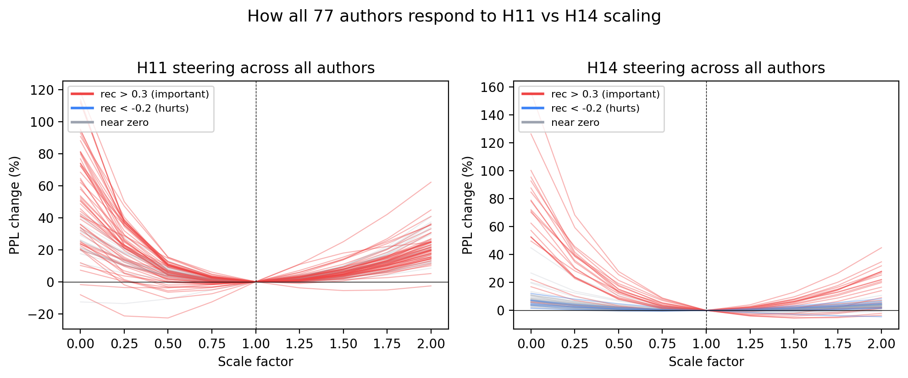
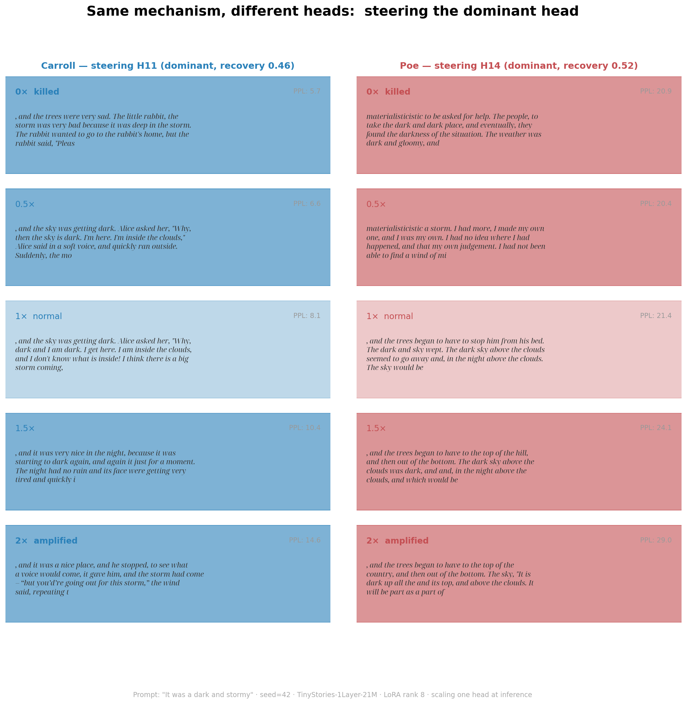
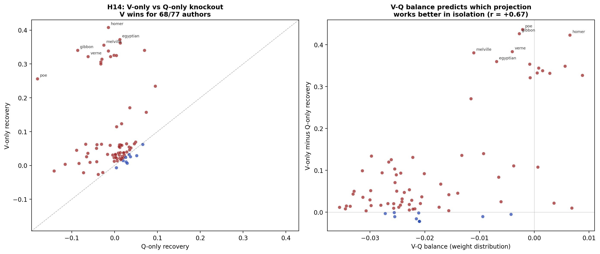
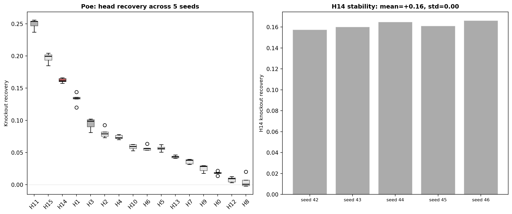

# Sixteen Voices: An Interpretability Experiment on a Tiny Transformer

*77 LoRA adapters, 16 heads, 1,232 knockout experiments — all on CPU*

---

You know what is beautiful about tiny models? That they are tiny.

Twenty-one million parameters. One attention layer with sixteen heads,
one MLP, and a residual stream [1]. Small enough to see everything.
Small enough to run on a laptop CPU.

I wanted to try interpretability experiments without a GPU budget. So
I picked the smallest model I could find that still produces coherent
text, and asked: **how far can you trace the chain from weights to
behavior?**

---

## Step 1: Make the model do different things

I trained 77 LoRA adapters [2] — one per author — on the same base
model. Poe, Carroll, Grimm, Melville, Homer, plus synthetic controls
like *minimalist*, *dialogue*, and *poet*.

Same prompt, same seed, different adapters:

> **Base model:** day. But I was brave and strong." So, the little
> girl said, "I will get us. I'm strong." And everyone cheered, and
> the little girl made sure she was happy. The End.
>
> **Poe:** , and the trees began to have to stop him from his bed. The
> dark and sky wept. The dark sky above the clouds seemed to go away
> and, in the night above the clouds.
>
> **Carroll:** , and the sky was getting dark. Alice asked her, "Why,
> dark and I am dark. I get here. I am inside the clouds, and I don't
> know what is inside! I think there is a big storm coming..."
>
> **Dialogue** (synthetic): night." "What do you know?" asked the moon.
> "I know sky," said the storm. "Many things fly up." "The moon is not
> there. Sometimes."
>
> **Lear:** , And the Waddle!

None of this is good prose. But the distributions are measurably
different — and now I have 77 different weight changes to look inside.

---

## Step 2: Do heads specialize?

Each adapter's weight change can be **sliced by head** — 16 blocks of
64 rows each. Keep one block, zero the rest, measure how much of the
adaptation survives [3]. Do that for all 77 authors × 16 heads =
1,232 knockout experiments.



*__Per-head knockout recovery.__ Each cell = how much one head recovers
of an author's full adaptation. H11 is dominant across nearly all
authors; H14 is strong for a specific cluster.*


*__Per-head recovery distribution.__ Each dot is one author. H11
(blue) leads, H3 (green) is a consistent second, H14 (red) has the
widest spread.*

**Yes, they specialize.** Three heads stand out:

**H11 is the dominant head** — highest mean recovery (0.38) and the
best single head for 51 out of 77 authors (66%).

**H3 is the quiet workhorse** — second-highest mean recovery (0.28),
consistently useful across nearly all authors, but rarely anyone's
single best (only 1 of 77).

**H14 is the wildcard** — best head for 18 authors (23%), but with
the highest variance of any head (std 0.29, 75% higher than the next).
It *actively hurts* for 9 authors (Shelley at −0.68, Stoker, Wilde,
Twain...). The bottom tier (H6, H12) contributes almost nothing.

### Two adaptation strategies

The interesting part is how these heads relate to each other. H11 and
H14 are anticorrelated across authors (r = −0.39): when one is
important, the other tends not to be. H14 and H3 are strongly
correlated (r = 0.72) — they travel together.



*Left: H11 vs H14 recovery per author — two clusters visible. Right:
H14 and H3 travel together.*

This looks like two adaptation strategies:

- **H11-led (51 authors, 66%):** Carroll, Grimm, the synthetic styles,
  most children's-story-adjacent authors. H11 leads (mean 0.46 when
  dominant), H14 barely contributes (mean 0.09 in this group).
- **H14-led (18 authors, 23%):** Homer, Poe, Milton, Browne, Lovecraft.
  H14 leads (mean 0.62 when dominant — actually stronger than H11 in
  its group), H3 is a strong second (mean 0.43), H11 is still useful
  but not dominant (mean 0.24). For some (Homer, Egyptian myth), H11
  is actually negative.

H11 and H14 aren't doing different jobs — they're doing the same job
for different authors. Both serve as the main style carrier for their
respective group. H3 is the reliable second in both, but is never the
main lever in steering (0 of 77 authors) — its contribution overlaps
with the dominant head.

What makes some authors land on H14 instead of H11 isn't obvious from
this data. It's not simply vocabulary distance from the base model,
since some equally "distant" authors (Korean, Kipling) get hurt by H14.

This pattern is learned, not random — untrained adapters don't show
it. See the [technical report](TECHNICAL.md) for exact numbers,
caveats on score inflation, and the null baseline.

---

## Step 3: Why these heads and not others?

So H11, H14, and H3 matter. H6 and H12 don't. What's different about them?
In a 16-head model, you can just look.

I ran the base model on short prompts and examined each head's
attention pattern [4]. The difference jumped out immediately:


 *__What heads look at (base model, single prompt).__ H6 attends
locally — mostly the previous token (diagonal). H10 spreads attention
across the full context. Same sentence, same model, two different
strategies.*

The heads that don't matter for style have focused attention — they
look at the previous token or a small local window. They handle
syntax, not style. The heads that carry style have diffuse attention
that spreads across broader context.



*__Head roles.__ Semantic heads (purple) carry the most recovery.
Structural heads (orange/yellow/green) contribute little per author.
H14 has the highest variability — the most author-specific head.*

I also compared attention patterns with and without LoRA across all
77 authors — not a single classification changes. The adapters change
*what heads output*, not *what they attend to*. This was the second
thing I didn't expect — LoRA adapts both Q and V projections, so
you might think it would change routing too. It doesn't. Style flows
through the value projections (see [technical report](TECHNICAL.md)
for the full stability analysis).

To double-check the knockout results, I ran steering [6, 7] —
scaling each head's output at inference time. If the knockout
rankings are real, steering should show the same pattern.



*__H11 vs H14 steering across all 77 authors.__ Each line is one
author. Y-axis = perplexity change vs normal (1×). H11 is a
symmetric V — everyone needs it at roughly 1×. H14 fans out —
the H14-cluster authors are sensitive to scaling, H11-dominant
authors barely react.*

The two-strategy pattern is clearly visible when you compare
individual authors:


*__Carroll (H11-led) vs Poe (H14-led).__ Kill the dominant head
and perplexity explodes. The non-dominant head barely registers.
Same mechanism, mirror image.*



*__Text comparison.__ Carroll without H11 becomes a generic rabbit
story. Poe without H14 generates nonsense ("materialisticistic...").
In both cases, amplifying the dominant head past 1× degrades the
output but keeps the character.*

The dominant head is the style head — it just depends on the author
which one that is. H3 is never the main steering lever for any
author (0 of 77) — despite high knockout recovery, its contribution
overlaps with the dominant head.

---

## Step 4: V changes work in isolation, Q changes don't

The knockout experiment keeps both V and Q LoRA for the isolated
head. But LoRA adapts two projections with fundamentally different
roles:

- **V** (value — what the head extracts from attended positions).
  V changes are **self-contained.** They modify what the head writes
  to the residual stream. Keep V, zero Q, and the head still looks
  at the same positions as the base model — but outputs new values.
  The change works standalone. (The MLP then processes the changed
  residual stream nonlinearly, so "self-contained" means at the
  attention output, not at the final logits.)
- **Q** (query — where the head attends). Q changes **depend on V.**
  They redirect attention to new positions — but those positions were
  selected during training to be useful *with the new V*. Keep Q,
  zero V, and the head looks in the right places but reads with the
  wrong lens. The routing was optimized jointly with V; without V,
  it's suboptimal.

This is a testable prediction: if you isolate V-only vs Q-only for
a single head, V should recover more than Q.

**Direct test.** I isolated each projection separately for H14
across all 77 authors. Keep only V LoRA (zero all Q), or keep only
Q LoRA (zero all V).

**V-only beats Q-only for 68 out of 77 authors** (88%). Mean V-only
recovery: +0.09. Mean Q-only recovery: −0.03. Isolating just V
still helps; isolating just Q actively hurts.



*__V-only vs Q-only knockout.__ Each dot is one author. Most sit
above the diagonal — V-only recovery exceeds Q-only for 88% of
authors.*

The V-Q weight balance (how much of H14's LoRA norm sits in V vs Q)
partially predicts H14's knockout recovery (r = +0.62) and the gap
between V-only and Q-only performance (r = +0.67). These
correlations are moderate — the mechanism is cleaner than the
prediction.

---

## Step 5: Is the head ranking stable?

One worry: maybe the head ranking is an artifact of one particular
LoRA training run. I retrained Poe's adapter 5 times with different
seeds. The full head ranking is preserved every time.



*__Retraining stability.__ Poe's adapter retrained 5× with different
seeds. The head ranking is preserved.*

The ranking is a property of the pretrained model, not of LoRA
randomness. A different pretraining seed would likely assign these
roles to different heads — but within one checkpoint, the structure
is fixed.

I also explored whether base model weights (before any LoRA) predict
which heads will matter — logit impact, V-sensitivity, amplification
ratios. There are suggestive correlations, but with only 16 heads
they're anecdotal at best. Details in the
[technical report](TECHNICAL.md) for those interested.

---

## Try it yourself

There's an interactive demo where you can pick any of the 77 authors,
see which heads matter most for them, and scale heads up or down to
see the effect:

```
streamlit run demos/app_steer.py
```

---

## What this is and what it isn't

None of the individual findings here are surprising to someone who
works on mechanistic interpretability. Head specialization in decoders
is documented [3, 4, 8]. The V-vs-Q isolation property follows from
the math if you think it through. The base model weight analysis is
suggestive at best. Recent work on fine-tuning circuits [10] finds
that fine-tuning preserves circuit nodes but rewires edges — our V-Q
mechanism is a specific instance: V changes modify node outputs, Q
changes rewire attention edges.

The field has largely moved to feature-level analysis via sparse
autoencoders [11, 12], which decompose activations into thousands of
interpretable directions — a much finer lens than per-head analysis.
We use heads as the unit of analysis deliberately: with only 16 of
them, you can enumerate everything. In a larger model you'd want SAEs.

The theoretical foundation comes from Elhage et al. [5], who show
that in a 1-layer attention-only model the output is a linear sum of
independent per-head contributions. Each head has a QK circuit (where
it looks) and an OV circuit (what it writes).

Our model is *close* to this but not identical — it has an MLP after
the attention layer. The residual stream carries each head's
contribution linearly to the output, but the MLP reads all heads'
outputs together and applies a nonlinear transformation (GELU). So
the per-head decomposition is approximate, not exact:

- **Knockout approximately isolates one head.** Through the residual
  stream, zeroing one head's LoRA removes one term from a linear sum.
  But the MLP also processes the changed residual nonlinearly, so
  there is a second-order interaction. The score inflation in the
  knockout matrix (recovery scores don't sum to 1) is likely this
  MLP interaction showing up.
- **V matters more than Q in isolation** because V changes are
  self-contained — the head writes new values regardless of where
  it looks. Q changes redirect attention to positions that were
  selected to work *with the new V*; remove V and the routing is
  suboptimal. The 68/77 V-only > Q-only result is a behavioral
  consequence of this asymmetry. The MLP complicates the downstream
  picture, but the asymmetry at the attention level is real.
- **H14's outsized effect despite small weights** comes from the
  OV circuit: H14's value weights are the smallest of any head, but
  its output projection amplifies them the most on the path to
  logits. Small perturbations in V get magnified. This is a property
  of the pretrained weights, visible before any fine-tuning — and
  it's why H14 is the most author-specific head despite having the
  least "room" in weight space.

The framework predicts that heads *can* be approximately isolated in
a 1-layer model. What it doesn't predict is which styles will land
in which heads, or that the same head can help one author and hurt
another. That's the empirical part.

What I think is interesting is the **systematic comparison across 77
fine-tuning targets**: not just which heads specialize, but the
direct V-only vs Q-only test across all of them. V changes survive
isolation, Q changes don't — and this holds for 88% of authors.
Prior work analyzed base model heads in isolation [5, 8, 9]. Running
the same knockout on 77 adapted models lets you test the V-Q
asymmetry empirically rather than just predicting it from the math.

This is a case study on one pretrained checkpoint. All findings
are properties of *this model*. A different pretraining seed would
shuffle which head does what. The approximate decomposability comes
from having one layer — every head writes to the same residual
stream, and the MLP is the only source of cross-head interaction.
In a deeper model, this would be far messier.

### Limitations

One architecture, one pretrained checkpoint, one layer. This is a
case study, not a general finding about attention heads. The model
has an MLP after the attention layer, so per-head independence is
approximate — the MLP mediates cross-head interactions. Recovery
scores are inflated partly for this reason (see
[technical report](TECHNICAL.md)).

---

## What's next

Does the V-Q mechanism hold in deeper models? Even in our 1-layer
model, the MLP introduces cross-head interactions that make the
decomposition approximate. In a 2-layer model, heads also compose
across layers — the decomposition gets messier on two fronts.

Per-head style signals are **transferable** — you can graft one
author's head weights into another's adapter and get a visible
vocabulary shift [13, 14] (see [transplant and interpolation
experiments in the overview article](ARTICLE_SIMPLE.md)).

Code and all 77 adapters are in the repo.

---

## References

[1] R. Eldan and Y. Li, ["TinyStories: How Small Can Language Models Be
and Still Speak Coherent English?"](https://arxiv.org/abs/2305.07759), *arXiv*, 2023.

[2] E. J. Hu et al., ["LoRA: Low-Rank Adaptation of Large Language
Models"](https://arxiv.org/abs/2106.09685), *ICLR 2022*.

[3] P. Michel, O. Levy, and G. Neubig, ["Are Sixteen Heads Really Better
than One?"](https://arxiv.org/abs/1905.10650), *NeurIPS 2019*.

[4] E. Voita et al., ["Analyzing Multi-Head Self-Attention: Specialized
Heads Do the Heavy Lifting, the Rest Can Be Pruned"](https://arxiv.org/abs/1905.09418), *ACL 2019*.

[5] N. Elhage et al., ["A Mathematical Framework for Transformer
Circuits"](https://transformer-circuits.pub/2021/framework/index.html),
*Anthropic*, 2021.

[6] A. Turner et al., ["Activation Addition: Steering Language Models
Without Optimization"](https://arxiv.org/abs/2308.10248), *arXiv*, 2023.

[7] K. Li et al., ["Inference-Time Intervention: Eliciting Truthful
Answers from a Language Model"](https://arxiv.org/abs/2306.03341),
*NeurIPS 2023*.

[8] J. Vig and Y. Belinkov, ["Analyzing the Structure of Attention in a
Transformer Language Model"](https://arxiv.org/abs/1906.04284), *ACL 2019
BlackboxNLP Workshop*.

[9] C. Olsson et al., ["In-context Learning and Induction
Heads"](https://arxiv.org/abs/2209.11895), *Transformer Circuits Thread*,
Anthropic, 2022.

[10] Z. Zhang et al., ["Towards Understanding Fine-Tuning Mechanisms
of LLMs via Circuit
Analysis"](https://arxiv.org/abs/2502.11812), *ICML 2025*.

[11] T. Bricken et al., ["Towards Monosemanticity: Decomposing Language
Models With Dictionary
Learning"](https://transformer-circuits.pub/2023/monosemantic-features),
*Anthropic*, 2023.

[12] A. Templeton et al., ["Scaling Monosemanticity: Extracting
Interpretable Features from Claude 3
Sonnet"](https://transformer-circuits.pub/2024/scaling-monosemanticity/),
*Anthropic*, 2024.

[13] G. Ilharco et al., ["Editing Models with Task Arithmetic"](https://arxiv.org/abs/2212.04089), *ICLR 2023*.

[14] C. Huang et al., ["LoRAHub: Efficient Cross-Task Generalization via Dynamic LoRA Composition"](https://arxiv.org/abs/2307.13269), *arXiv*, 2023.

[15] Q. Zhang et al., ["AdaLoRA: Adaptive Budget Allocation for Parameter-Efficient Fine-Tuning"](https://arxiv.org/abs/2303.10512), *ICML 2023*.