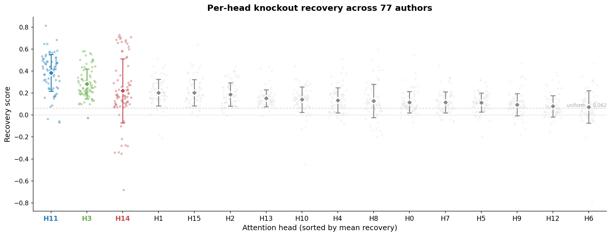
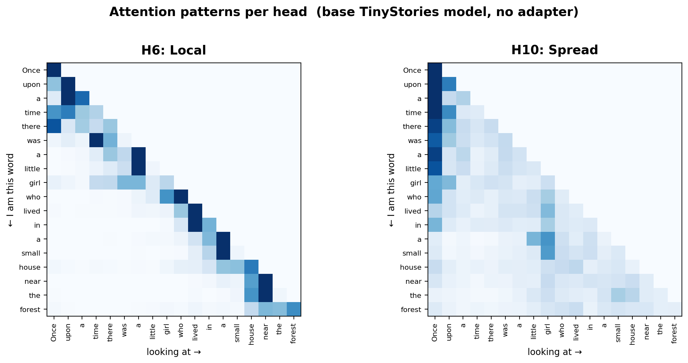
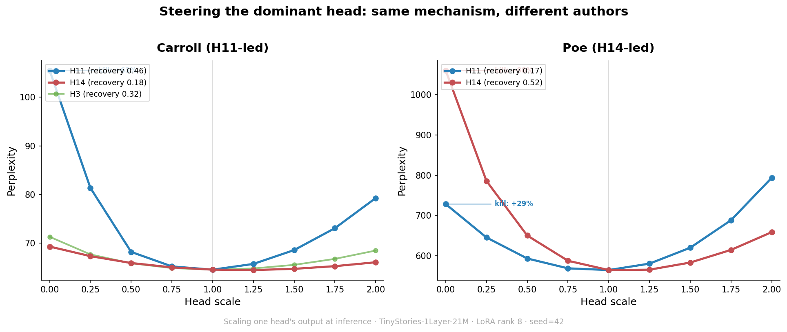
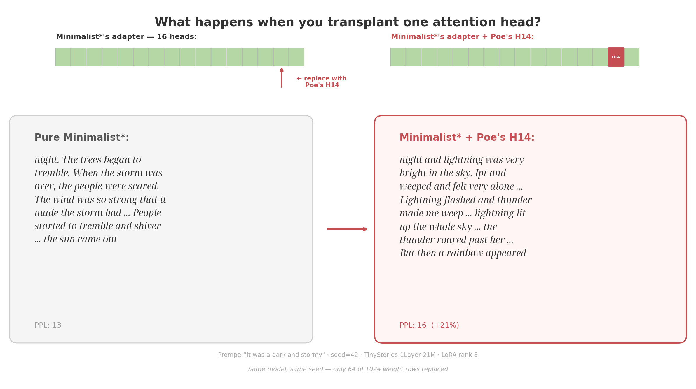
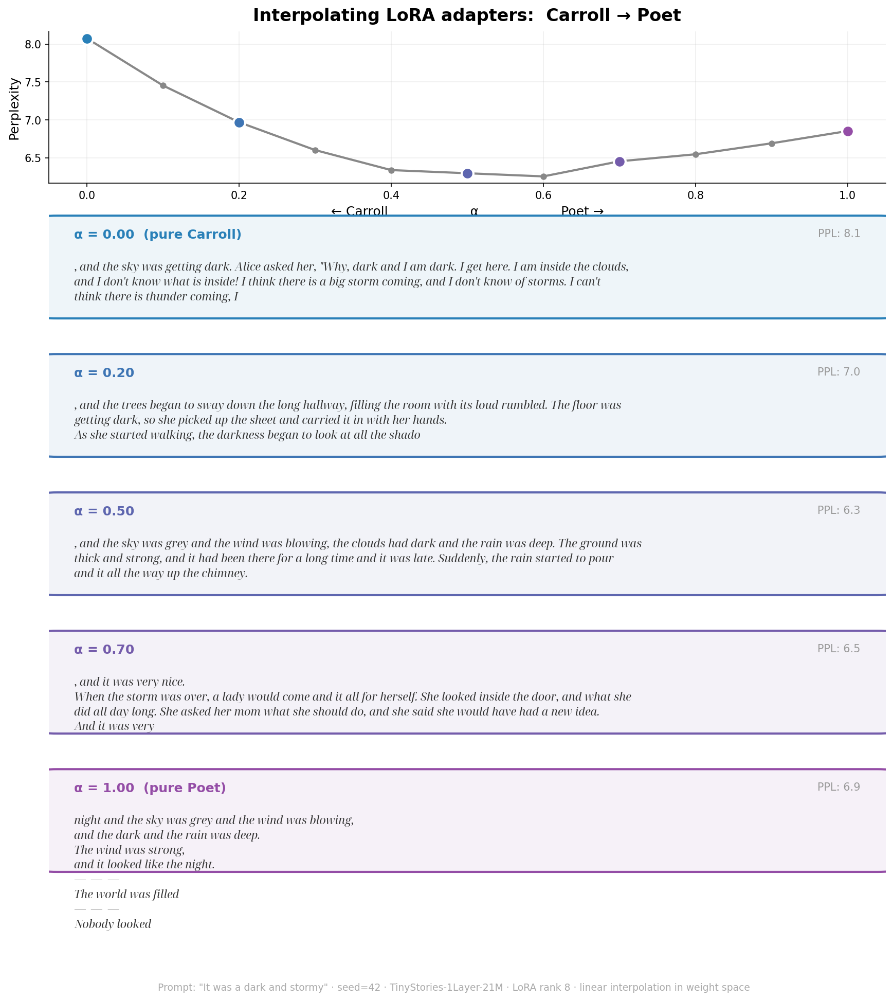

# Sixteen Voices: An Interpretability Experiment on a Tiny Transformer

You know what is beautiful about tiny models? That they are tiny.

TinyStories-1Layer-21M: 21 million parameters, one attention layer — you could literally put this model in your pocket if it existed physically. You could hold it in your hand and watch what's happening inside. And that's what I did.

TinyStories is trained on children's stories. I tried to make it write like real authors.

I trained 77 LoRA adapters — one for each author or style. I trained them on my laptop CPU, because why not. They are small. Then I inspected the model's behavior. Are all attention heads equally important? Does that change across trained LoRAs? Can I steer one attention head to make the Poe model more Poe? Can I interpolate between adapters to mix styles? Can I transplant one attention head from one adapter to another to achieve new behavior?

Although I found some interesting (and, by the literature, expected) behavior, the model itself is small and this is a toy experiment — the observed effects were subtle. But it was fun, so I'm writing about it.

## Make the model do different things

LoRA is a fine-tuning technique where you freeze the original model and train a small add-on — a lightweight "patch" on the weights. Same base model, 77 different patches. Most are real authors from Project Gutenberg — Poe, Carroll, Grimm, Melville, Homer. A few are synthetic styles I wrote myself — *minimalist* (short simple sentences), *dialogue* (all conversation), *poet* (line breaks and rhythm). Real authors mix many stylistic features at once, which makes it hard to tell what exactly the model learned. The synthetic styles isolate one feature at a time, so when something changes in an experiment, you can actually see it.

Same prompt ("It was a dark and stormy"), same seed, different adapters:

> **Base model:** day. But I was brave and strong." So, the little girl said, "I will get us. I'm strong." And everyone cheered, and the little girl made sure she was happy. The End.
>
> **Poe:** , and the trees began to have to stop him from his bed. The dark and sky wept. The dark sky above the clouds seemed to go away and, in the night above the clouds.
>
> **Carroll:** , and the sky was getting dark. Alice asked her, "Why, dark and I am dark. I get here. I am inside the clouds, and I don't know what is inside! I think there is a big storm coming..."
>
> **Dialogue** (synthetic): night." "What do you know?" asked the moon. "I know sky," said the storm. "Many things fly up." "The moon is not there. Sometimes."
>
> **Lear:** , And the Waddle!

None of this is good prose. But the outputs are measurably different — and now I have 77 different weight patches to look inside.

---

## Do all heads matter equally?

This model has 16 attention heads — 16 parallel "readers" that each look at the input and decide what's important. The question is: when we add a LoRA patch, do all 16 heads contribute equally to the style change?

To test this, I isolated each head's LoRA weights one at a time — keep one head's patch, zero out the other 15 — and measured how much of the style adaptation that single head recovers. That's 77 authors × 16 heads = 1,232 experiments.

*Each dot is one author. Heads sorted by mean recovery. H11 (blue) leads, H3 (green) is a consistent second, H14 (red) has the widest spread — essential for some authors, actively harmful for others.*

Not all heads matter equally — and it's not the same head for every author. **H11** leads for most (66% of authors). **H14** leads for a smaller cluster — Homer, Poe, Milton, Lovecraft — but actively hurts for others. They're anticorrelated: when one matters, the other tends not to. Both do the same job — carry the main style signal — just for different authors.

This pattern is learned, not random — I tested with untrained LoRA patches and the specialization disappears.

---

## Why these heads?

I looked at what each head does in the base model (before any LoRA):

The heads that don't matter for style have focused, local attention — they track the previous word. The heads that matter have diffuse attention that spreads across the context.

One more thing I didn't expect: LoRA changes *what* heads output, not *where* they look. I compared attention patterns across all 77 adapters and the patterns are stable.

---

## Can I steer style at inference time?

If certain heads matter for style, I should be able to turn them up and down like a dial. So I scaled individual head outputs at inference time — from 0× (killed) to 2× (amplified).

*Carroll is H11-led — kill H11 and perplexity spikes. Poe is H14-led — kill H14 and perplexity explodes. Same mechanism, different dominant head.*

Kill the dominant head and the style vanishes. Carroll without H11 becomes a generic rabbit story. Poe without H14 starts generating nonsense. The dominant head is the style head — it just depends on the author which one that is.

---

## Can I transplant a head from one author to another?

This is the fun one. Take Minimalist's adapter, replace just head 14's weights with Poe's head 14, and generate. That's 64 out of 1,024 weight rows swapped — one head out of sixteen.

*Pure Minimalist: "The trees began to tremble. The people were scared." Minimalist + Poe's H14: "Lightning flashed and thunder made me weep... the thunder roared past her... But then a rainbow appeared." The simple sentence structure stays, but Poe's dark vocabulary floods in.*

The same works for Carroll — Alice keeps asking questions, but about thunder instead of clouds. And for Grimm — the fairy-tale framing stays but the wind becomes a hurricane.

It's not perfect — perplexity goes up (the model is slightly confused by the foreign head), and the effects are subtle. But swapping 6% of the LoRA weights produces a visible shift in the right direction. That's kind of delightful.

---

## Can I blend two authors?

Instead of swapping one head, what if I blend the entire adapter? Take Carroll's LoRA weights, take Poet's (a synthetic style I wrote with line breaks and rhythm), and linearly interpolate: `(1-α) × Carroll + α × Poet`.

*At α=0 Alice asks questions inside the clouds. By α=0.5 the dialogue is gone — "the sky was grey and the wind was blowing, the clouds had dark and the rain was deep." By α=0.8 line breaks appear between stanzas. At α=1 it's full verse: "The wind was strong, / and it looked like the night."*

You can watch the prose restructure itself. First Alice's dialogue fades, then the sentences get longer and more rhythmic, and finally line breaks appear. The perplexity curve drops smoothly — the blend works at every point along the way.

Not all pairs blend this cleanly though. Poe → Carroll breaks down around α=0.5 — the model produces gibberish. Those adapters are too far apart in weight space. LoRA weight space isn't a style space — some paths are smooth, others aren't.

---

## What this is and what it isn't

This is a toy experiment on one tiny checkpoint. The model has 21M parameters, one layer, and writes children's stories. The effects I found are real but subtle — don't expect dramatic transformations.

The individual findings aren't novel. Head specialization in transformers is well documented. What was fun was testing it all empirically across 77 adapters in a model small enough to see everything, on a laptop CPU, without any budget.

If you're curious about the details — the two-strategy analysis, exact numbers, null baselines, V-only vs Q-only decomposition — there's a [detailed writeup](ARTICLE_SHORT.md) and a [full technical report](TECHNICAL.md) with all the code in the repo.

*Code and all 77 adapters: [link]*
*Interactive demo (steer heads yourself): [link]*

---

## What's next

This was all behavioral — poke the model, observe what changes. The next step is to look inside the actual computations: trace the OV circuits to see which vocabulary directions each head projects onto in the residual stream. Actual mechanistic interpretability, not just ablation.

A few things I want to try:

- **Two-layer model.** Does the clean head specialization survive when heads can compose across layers?
- **Hypernetwork.** Can I train a small network that predicts LoRA weights from a text sample? If it works, the 77 adapters live on a low-dimensional manifold.
- **SAE on the residual stream.** Instead of asking "which head matters," ask "which features activate for which author" — a much finer lens.

---

## References

[1] R. Eldan and Y. Li, ["TinyStories: How Small Can Language Models Be and Still Speak Coherent English?"](https://arxiv.org/abs/2305.07759), 2023.

[2] E. J. Hu et al., ["LoRA: Low-Rank Adaptation of Large Language Models"](https://arxiv.org/abs/2106.09685), ICLR 2022.

[3] P. Michel, O. Levy, and G. Neubig, ["Are Sixteen Heads Really Better than One?"](https://arxiv.org/abs/1905.10650), NeurIPS 2019.

[4] E. Voita et al., ["Analyzing Multi-Head Self-Attention: Specialized Heads Do the Heavy Lifting"](https://arxiv.org/abs/1905.09418), ACL 2019.

[5] N. Elhage et al., ["A Mathematical Framework for Transformer Circuits"](https://transformer-circuits.pub/2021/framework/index.html), Anthropic, 2021.

[6] A. Turner et al., ["Activation Addition: Steering Language Models Without Optimization"](https://arxiv.org/abs/2308.10248), 2023.

[7] Z. Zhang et al., ["Towards Understanding Fine-Tuning Mechanisms of LLMs via Circuit Analysis"](https://arxiv.org/abs/2502.11812), ICML 2025.