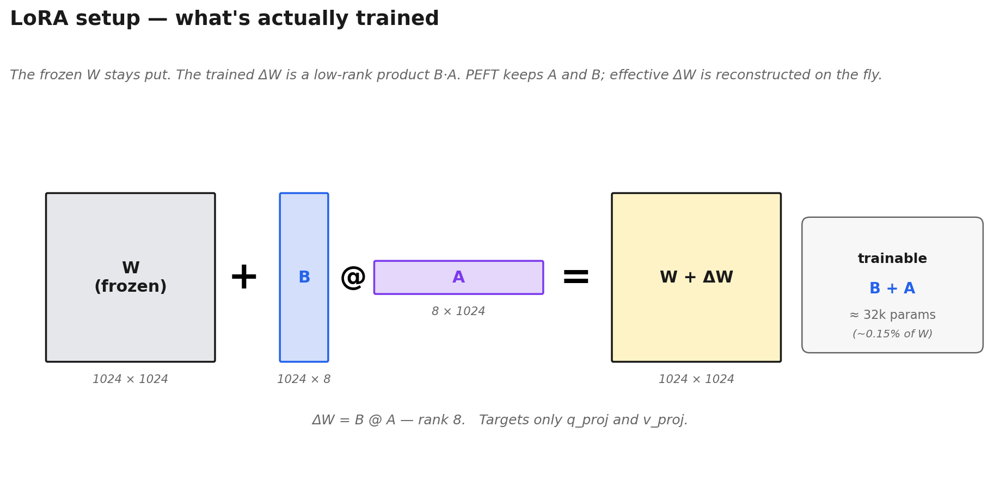
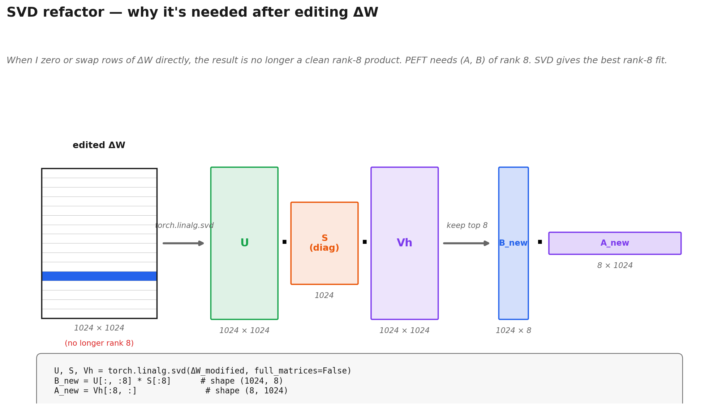
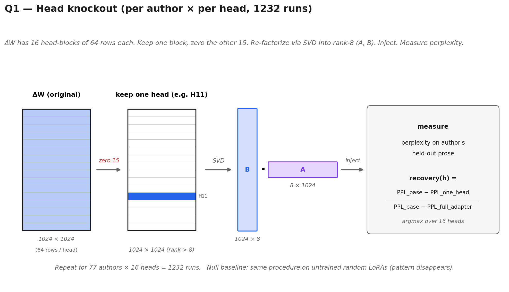
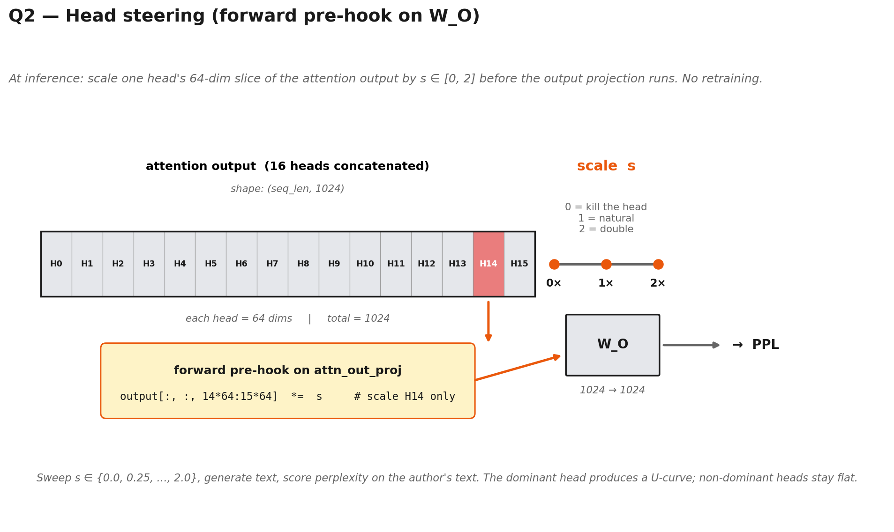
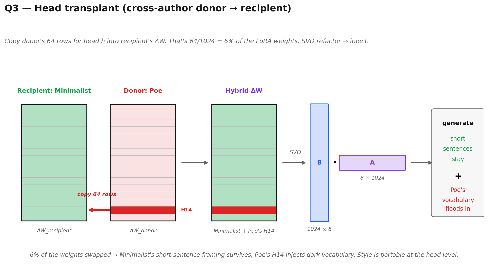
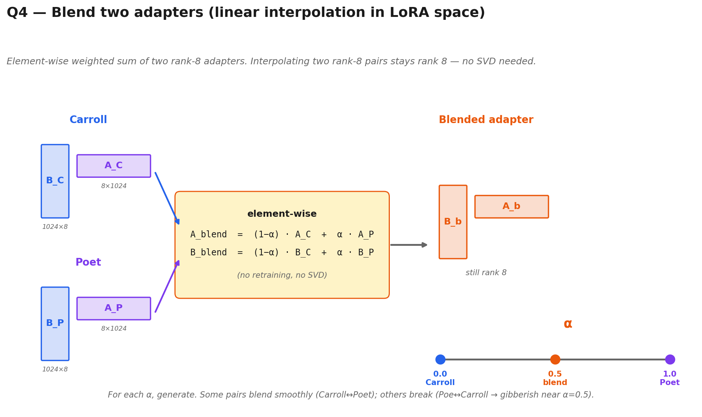
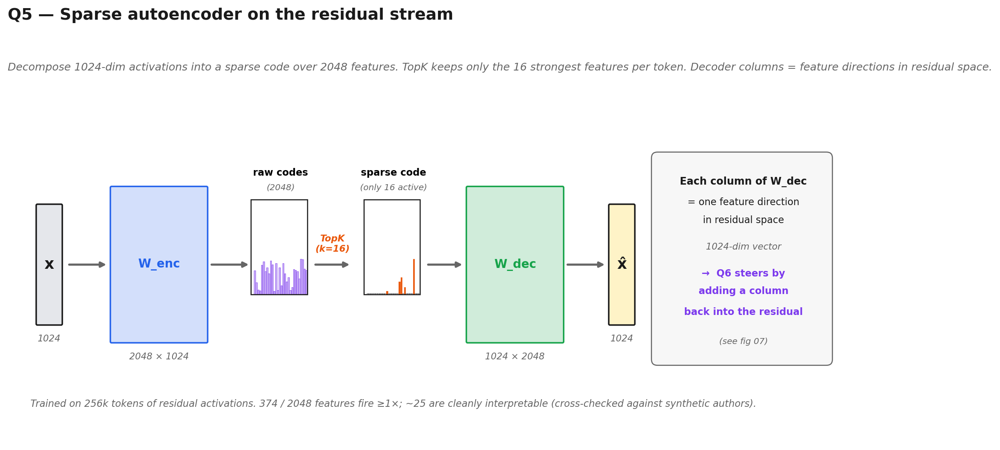
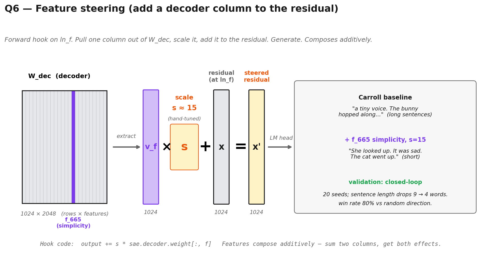
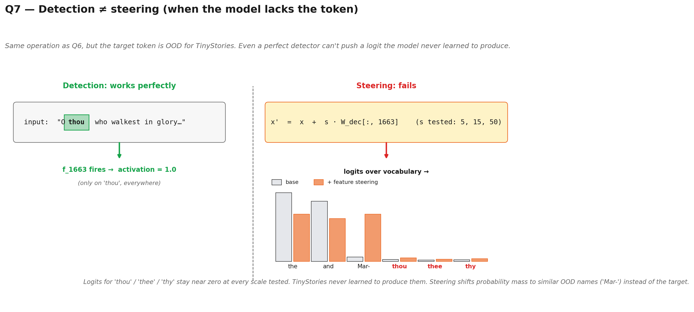

# Methodology per Poster Panel

Detailed methodology for each Q1–Q8 on the poster. Meant as a defensive reference — when someone at the session asks *"how exactly did you measure that?"*, the answer is here.

Each section: **what I did → what I measured → caveats → code pointer**.

---

## Setup (shared across all questions)

- **Base model:** [TinyStories-1Layer-21M](https://huggingface.co/roneneldan/TinyStories-1Layer-21M) — 21M parameters, 1 transformer layer, 16 attention heads, 1024-dim residual, 50k GPT-Neo vocab. Trained on children's stories.
- **Hardware:** one laptop CPU. No GPU.
- All results seed-fixed (`seed=42` unless stated).



### LoRA training details

Standard PEFT LoRA configuration (`src/sixteen_voices/model.py → create_lora_model`):

| Parameter | Value | Note |
|---|---|---|
| rank `r` | **8** | `RANK` in `src/sixteen_voices/constants.py` |
| `lora_alpha` | **32** | effective scaling factor α/r = 4 |
| target modules | **`q_proj`, `v_proj`** only | following Hu et al. 2022 recommendation |
| attn_out, MLP | **not adapted** | deliberate — keeps the comparison focused on where attention reads |
| `lora_dropout` | 0.0 | |
| `bias` | `"none"` | |
| task type | `CAUSAL_LM` | |
| trainable params | ~16k per projection × 2 projections ≈ **32k / adapter** | ~0.15% of the 21M base model |

Per-author training (`scripts/train_lora.py`):

| Parameter | Value |
|---|---|
| optimizer | AdamW |
| learning rate | 5e-4 |
| epochs | 8 |
| batch size | 4 |
| max sequence length | 512 tokens |
| chunk stride | 256 tokens (overlapping chunks) |
| validation split | 10% (last chunks held out) |
| loss | standard causal LM cross-entropy |

**Data.** One text file per author (`data/authors/{name}.txt`). Real authors: concatenated works from Project Gutenberg, cleaned via `clean_text` (drops Gutenberg boilerplate, normalizes whitespace). Synthetic authors: hand-written text isolating one stylistic property (e.g., Minimalist = short simple sentences, Dialogue = all conversation, Cozy = food/warmth vocabulary). Download script: `scripts/download_authors.py`.

Training was deliberately lightweight — no hyperparameter sweep per author. The goal was "same recipe, different author" so differences across adapters trace back to data, not tuning.

### 77 LoRA adapters

69 real authors (Project Gutenberg: Poe, Carroll, Grimm, Milton, Blake, Lear, Homer, Shelley, Melville, Lovecraft, Lear, Wilde, Stoker, Browne, Gibbon, Johnson, Carlyle, Pater, Verne, Hawthorne, De Quincey, Alcott, Baum, Burnett, ...) + 8 synthetic style archetypes (Minimalist, Dialogue, Poet, Cozy, First-person, Questioner, Simple-vocab, Repeater). Full list in `data/authors/`.

### Delta matrices and SVD reconstruction

When you load an adapter, you get two pairs of low-rank matrices per projection: `A ∈ ℝ^(8 × 1024)` and `B ∈ ℝ^(1024 × 8)`. The effective weight update is:
```
ΔW = B @ A   ∈ ℝ^(1024 × 1024)
```
This 1024×1024 matrix is what `load_adapter_deltas` returns. Its rows are indexed by the output head (64 rows per head × 16 heads).

For head knockout and head transplant, I manipulate the full ΔW matrix (zero or swap contiguous 64-row blocks), then **re-factorize** back to a rank-8 A/B pair via truncated SVD:
```
U, S, Vh = torch.linalg.svd(ΔW_modified, full_matrices=False)
B_new = U[:, :8] * S[:8]
A_new = Vh[:8, :]
```
and inject `A_new`, `B_new` back into the PEFT model. Code: `src/sixteen_voices/adapter.py → knockout_all_except`, `delta_to_AB`.



#### What is SVD, and why do I need it here?

**Singular Value Decomposition** factorizes *any* matrix `M` (here 1024×1024) into three pieces:

```
M  =  U · diag(S) · Vh
       └─┬─┘   └─┬─┘   └┬┘
       output  scale  input
        basis  factors  basis
```

- `U` — orthonormal columns: the directions M maps *to*.
- `S` — singular values, sorted **largest → smallest**: how much M stretches along each direction.
- `Vh` — orthonormal rows: the directions M comes *from*.

Geometrically, every linear map is "rotate → stretch → rotate". SVD reads off those three steps. The singular values tell you which directions carry most of the matrix's "energy."

**Why I truncate to top 8.** PEFT requires LoRA updates to be rank-8: a `(1024, 8)` matrix times an `(8, 1024)` matrix. Keeping only the 8 largest singular values gives the **best rank-8 approximation** of any matrix (Eckart–Young theorem). I then absorb the singular values into `B_new`:

```
B_new = U[:, :8] · diag(S[:8])     # shape (1024, 8)
A_new = Vh[:8, :]                   # shape (8, 1024)
ΔW_approx ≈ B_new @ A_new
```

**For knockout: it's lossless.** The original `ΔW` was already rank ≤ 8 (it came from `B·A` with `B, A` rank 8). Zeroing whole rows of a rank-8 matrix can only *reduce* the rank — it stays ≤ 8. So the rank-8 SVD reconstructs it exactly.

**For transplant: it's lossy.** Recipient ΔW is rank 8, donor ΔW is rank 8, so the hybrid can be up to rank 16. Truncating to 8 keeps the dominant directions but discards some information. Perplexity rises slightly — that's where the cost shows up.

(For LoRA *interpolation* in Q4, I work on `A` and `B` directly — no SVD — because interpolating two rank-8 pairs element-wise also gives a rank-8 pair.)

---

## Q1 · Do all 16 heads matter equally?



**What I did.** For each author × each head (77 × 16 = 1,232 experiments): kept one head's rows of the LoRA delta matrix, zeroed the rest, measured perplexity on the author's held-out prose.

**Metric — recovery score:**
```
recovery(h) = (base_ppl − single_head_ppl(h)) / (base_ppl − full_adapter_ppl)
```
`recovery = 1` → that head alone reproduces the full LoRA improvement. `recovery = 0` → nothing. Can be negative (keeping that head alone is *worse* than no LoRA).

**Leading head per author =** `argmax(recovery)` across the 16 heads.

**Results:**
- H11 leads for 51/77 authors.
- H14 leads for 18/77 — the elevated-register cluster (Homer, Milton, Poe, Melville, Lovecraft, Browne, ...).
- H3 never leads for any author, but has the 2nd-highest mean recovery (0.28) with low std — the "universal backup."
- No other head leads for more than 3 authors.

**Caveats:**
1. 15/77 (19%) of "leaders" are near-ties (margin < 0.05 between #1 and #2). For those authors the winner could flip with a different eval text.
2. Knockout tests *individual strength*, not *synergy*. If H11+H3 together recover 95% but each alone is 40%, this method would miss the collaboration.
3. Knockout does **not** prove the other 13 heads are redundant — only that none of them carries style alone. Top-k retention experiment not run.
4. Perplexity is a proxy for style, not style itself.

**Code:** `scripts/knockout.py`. **Data:** `outputs/knockout_all_heads.json`. **Figure:** `figures/knockout_best_head.png` (bar chart) + `figures/knockout_strip_clean.png` (per-author dots) + `figures/knockout_scatter.png` (H11 vs H14).

---

## Q2 · Can I steer a head like a dial?



**What I did.** At inference time, register a forward pre-hook on the attention output projection (`W_O` input). The hook multiplies a specific head's 64-dim slice of the pre-projection tensor by a scale factor `s ∈ [0, 2]`. Generate text, measure perplexity on the author's text. Sweep `s` from 0 to 2.

- `s = 0` → kill the head (zero its contribution).
- `s = 1` → natural adapter output.
- `s = 2` → double its contribution.

**Results:**
- Carroll's U-curve on H11: minimum at 1, spikes to +60% perplexity when killed.
- Poe's U-curve on H14: minimum at 1, spikes to +88% perplexity when killed.
- Non-dominant heads produce nearly flat curves.

**What this shows:** steering the dominant head is a continuous, smooth operation. Away from 1× in *either direction* degrades style. Same mechanism across authors; different dominant head.

**Bonus finding.** Attention patterns (where heads *look*) are stable across all 77 adapters (comparison in `figures/attention_patterns.png`). So LoRA changes what heads *output*, not where they *attend*. This matches Elhage et al.'s OV/QK decomposition.

**Caveats:**
1. Perplexity is computed on the author's text — style drift is inferred, not measured directly.
2. The qualitative text examples (Carroll → "generic rabbit story" when H11 killed) are single-seed generations. Pattern reproduces across seeds but dramatic quotes are cherry-picked for readability.

**Code:** `src/sixteen_voices/steering.py` (hook factory), `scripts/fig_steering_contrast.py`, `scripts/fig_carroll_steering.py`, `scripts/fig_poe_steering.py`.

---

## Q3 · Can I transplant a head from one author to another?



**What I did.** Take two LoRA adapters (recipient + donor). The LoRA delta matrix has shape `(1024, 1024)` for each projection (`q_proj`, `v_proj`). Each head's rows are a contiguous 64-row block. Copy the donor's rows for head `h` into the recipient's delta. Inject into the model, generate.

For Q3 specifically: recipient = Minimalist, donor = Poe, `h = 14`. That's 64 / 1024 ≈ **6% of the LoRA weights** swapped (per projection).

**Results:**
- Minimalist pure: *"The trees began to tremble. The people were scared."* (short sentences).
- Minimalist + Poe's H14: *"Lightning flashed and thunder made me weep... the thunder roared past her..."* (short sentences preserved, Poe's dark vocabulary injected).
- Same pattern for Carroll + Poe's H14 (Alice asks questions, but about thunder instead of clouds) and Grimm + Poe's H14 (fairy-tale framing stays, storms intensify).

**What this shows:** head-level knowledge is portable between adapters. Style isn't smeared across all 16 heads — enough of it lives in H14 that a 6% swap has a visible, directional effect.

**Caveats:**
1. Perplexity goes up (the model is slightly confused by the foreign head). Transplants are lossy.
2. Effects are subtle — you need to read carefully to see the shift. Don't expect dramatic transformations.
3. Only tested H14 transplants systematically; other head transplants not exhaustively swept.

**Code:** `scripts/transplant.py`, `scripts/fig_transplant.py`. **Data:** `outputs/transplant_samples.json`, `transplant_new.json`.

---

## Q4 · Can I blend two authors?



**What I did.** Linear interpolation in LoRA weight space:
```
delta_blended = (1 − α) × delta_A + α × delta_B
```
applied element-wise to both `q_proj` and `v_proj` delta matrices. Inject into the model, generate. No retraining.

For the poster's example: A = Carroll, B = Poet, α ∈ {0.0, 0.1, ..., 1.0}.

**Results for Carroll → Poet:**
- α = 0.0: Alice asks questions inside the clouds (pure Carroll).
- α = 0.5: dialogue fades, clouds turn grey.
- α = 0.8: stanza-like line breaks start appearing.
- α = 1.0: full verse (pure Poet).
- Perplexity on a generic TinyStories eval sentence dips in the middle — because both endpoints pull away from generic distribution, and blending dilutes each bias (see FAQ for why this isn't "the blend is better").

**Broader finding:** Poe ↔ Carroll breaks around α=0.5 (gibberish). So not every pair blends smoothly. LoRA weight space is not a style space — some paths are coherent, others are not.

**Caveats:**
1. Single-seed generations; the specific α=0.8 "stanza" output is one example.
2. "Breaks when far apart" is a general finding (some pairs gibberish), not a claim about Carroll↔Poet specifically (which is smooth).
3. Interpolation is in raw weight space, not in a learned style manifold. A learned style manifold is future work (hypernetwork).

**Code:** `scripts/fig_interpolation.py`, `demos/app_poster_blend.py`. **Data:** `outputs/interpolation_samples.json`, `interpolation_sweep.json`.

---

## Q5 · What do these heads actually compute?



**What I did — SAE training.**
- Collected 256k tokens of residual-stream activations from the adapted models, 1024-dim each.
- Trained a sparse autoencoder: TopK activation (`k=16`), 2048 features, 10 epochs.
- Reconstruction: `x_hat = W_dec @ TopK(W_enc @ x + b_enc)`. No L1 penalty (TopK enforces sparsity).
- Of 2048 features, **374 fire at least once** (rest are dead). Of those, about **25 are cleanly human-interpretable** per grounded labeling (see methodology below).

**What I did — feature labeling (grounded, not guessed).**
- For each alive feature, collect the tokens on which it fires most strongly → read the context.
- For each synthetic author (Minimalist, Dialogue, Cozy, ...), identify features that fire disproportionately on that author's text.
- Cross-check: a label only stands if (a) the top-firing tokens match the hypothesis AND (b) the feature correlates with the matching synthetic author's text.
- Earlier attempt (labeling from real author profiles alone) produced labels that didn't survive synthetic cross-checks. This was thrown out. Full pipeline in `docs/METHODOLOGY_SAE.md`.

**What I did — head roles.**
- For each feature, regress its activations against each head's output (projection onto the feature direction).
- Heads "own" features they explain a disproportionate fraction of. Heads that share features form clusters.
- **H11:** dominant for 51 authors, but its features share zero overlap with any other head. Named "workhorse (isolated)."
- **H3:** 55 features — the broadest reader. Strongly tracks conversational verbs, average word length.
- **H14:** 10 features — suppresses first-person "I" and conversational verbs, amplifies rare vocabulary. Helps third-person elevated narration, hurts first-person conversational prose.
- **MLP:** 27 features with no single-head owner. These emerge from MLP nonlinearity. Weight-based steering can't reach them; activation steering can.

**Caveats:**
1. 374 alive features out of 2048 is low — more features would likely emerge with longer training or a larger SAE. But a 21M single-layer model may genuinely not have more than ~25 distinct stylistic concepts to decompose.
2. Labels are grounded in synthetic authors' isolated properties; for real authors, features are less clean because real authors mix many stylistic dimensions.
3. Head-to-feature attribution is a regression against head projections — approximate, not causal.
4. "MLP features" means "features not well-explained by any single head's projection." The MLP's role is inferred, not directly shown.

**Code:** `src/sixteen_voices/sae.py`, `scripts/analyze_sae.py`, `scripts/analyze_head_profiles.py`, `scripts/fig_sae_heads_roles.py`. **Data:** `outputs/sae_topk16_2048/sae_weights.pt`, `feature_head_analysis.json`, `feature_report_all.txt`. **Figures:** `sae_heads_roles.png`, `sae_token_heatmap_article.png`.

---

## Q6 · Can I steer with individual features?



**What I did.** Each SAE feature has a **decoder column** — a 1024-dim direction in residual space. To steer with feature `f`, register a forward hook on `model.transformer.ln_f` that adds `scale × sae.decoder.weight[:, f]` to its output. Generate text.

Used for Q6 Carroll showcase:
- `f665` simplicity · scale ≈ 15
- `f1779` first-person "I" · scale ≈ 12
- `f689 + f1777` dialogue (composite) · scale ≈ 8
- `f344` verse line-breaks

**Measurement — closed-loop validation.** For each steering hypothesis, generate 20 seeds at baseline vs steered. Measure the target property (average sentence length, count of `I`, count of `said`, count of line breaks). A feature "works" if:
- Win rate > 50% vs random-direction baseline.
- Effect direction matches hypothesis.

Example: simplicity (f665) drops Carroll's sentence length from ~9 words to ~4 words. Closed-loop 80% vs 20% random. Feature **works**.

**Features also compose.** Adding multiple feature vectors (questions + dialogue + simplicity) produces a coherent voice with all three properties. This is additive, no retraining.

**Caveats:**
1. Steering strength (scale) had to be hand-tuned per feature. Too low = no effect; too high = model collapses into repetition.
2. "Works" is defined against measurable properties (sentence length, token counts). Subjective feature effects are not validated quantitatively.
3. Verse (f344) works on Blake but is marginal on non-verse authors. "Structural" features don't always work universally.

**Code:** `scripts/fig_sae_showcase.py`, `scripts/validate_sae_steering.py`, `scripts/sweep_sae_steering.py`. **Data:** `outputs/sae_topk16_2048/steering_sweep.json`. **Demo:** `demos/app_poster.py` · live at `sixteen-voices.streamlit.app`.

---

## Q7 · Does detection equal steering?



**What I did.** Identify SAE features that fire **perfectly** on specific tokens:
- `f1663` → "thou" (fires only on that token, across Blake/Milton/etc.)
- `f1767` → "thee"
- `f1621` → "thy"

These are textbook monosemantic detectors. If steering = detection, injecting their decoder columns during generation should produce archaic pronouns.

**Result:** it doesn't. At every scale tested (small, medium, large), on every model tested (base, Blake, Milton, Byron, Wilde, Poe, Minimalist), the steered model **never produces "thou," "thee," or "thy."** At moderate scale, output shifts toward Mary-type names (Mar-, -illa). At high scale, the model collapses into token repetition.

Same for the "Marilla" detector (`f...` specific to Montgomery) — fires precisely on "Mar" and "illa" subtokens, but injecting it never produces Marilla. At moderate scale: shift toward "Mar-" prefixed names. At high scale: collapse.

**Why?** Model capacity. These tokens are out-of-distribution for TinyStories. Even a LoRA-adapted Blake can't push their logits high enough to output them. **Steering amplifies what the model can already express.** This matches Anthropic's Golden Gate Bridge observation (Claude can talk about the bridge fluently because it's deep in training data; TinyStories can't write "thou" for the same reason inverted).

**Caveats:**
1. "Perfect detector, useless steerer" is a striking pattern but not proven universal — only demonstrated for archaic pronouns and a few name detectors.
2. The claim rests on multiple seeds and multiple scales; individual seed failures are reported, not treated as decisive.

**Code:** `scripts/sweep_sae_steering.py` (archaic pronoun sweeps), `outputs/sae_topk16_2048/steering_sweep_archaic_adapted.json`.

---

## Q8 · Where does style live?

**Synthesis of Q1–Q7, not a new experiment.** The finding:

**Style lives in two layers:**

1. **STRUCTURAL layer** — universal knobs (simplicity, dialogue, first-person, verse line-breaks). These features *steer on any adapter*. `f665` (simplicity) works on every author because TinyStories can always produce short sentences. These are shared machinery of the base model that LoRAs re-weight.

2. **SEMANTIC layer** — author-specific fingerprints (dark atmosphere, cozy food, dialect). These features *detect* across the full corpus but *only steer* when paired with the matching adapter. `f1988` (cozy food) needs the Cozy LoRA to push the right vocabulary into logits.

**Two more claims:**

- **LoRAs amplify, they don't create.** Almost every interpretable feature in an adapted model is already present (though weakly) in the base model. Fine-tuning selects and amplifies; it doesn't invent.
- **The strongest style direction lives in the MLP.** The simplicity feature (`f665`) has no single-head owner — knockout experiments can't find it. It emerges from how the MLP transforms the combination of head outputs. Activation steering reaches it (100% win rate on simplicity); weight steering doesn't (coin flip).

**Caveats:**
1. "Two layers" is a framing that fits the data; it isn't a formal proof of a dichotomy. Some features sit between (e.g., f1604 "periods at sentence boundaries" is partly structural, partly correlated with H14's anti-first-person effect).
2. "Strongest style direction lives in MLP" is measured as *highest activation-steering win rate* for features with no head owner. Other definitions of "strongest" could give different answers.
3. This whole conclusion is calibrated for **this** 21M 1-layer model. It's a testable hypothesis for larger models, not a general theorem. Anthropic's emotion-concept paper (Nov 2025) shows semantic directions steering universally on Claude — consistent with the prediction that larger models don't need per-style adapters for semantic features.

---

## General limits

This is one tiny model. N=1 for the base architecture. All findings need replication on:
- A larger TinyStories-style model (e.g., 2-layer).
- A different architecture family.
- A different domain (non-narrative text).

The effects observed are real but subtle. This is a playful experiment, not rigorous research. The poster and articles consistently frame it that way.
