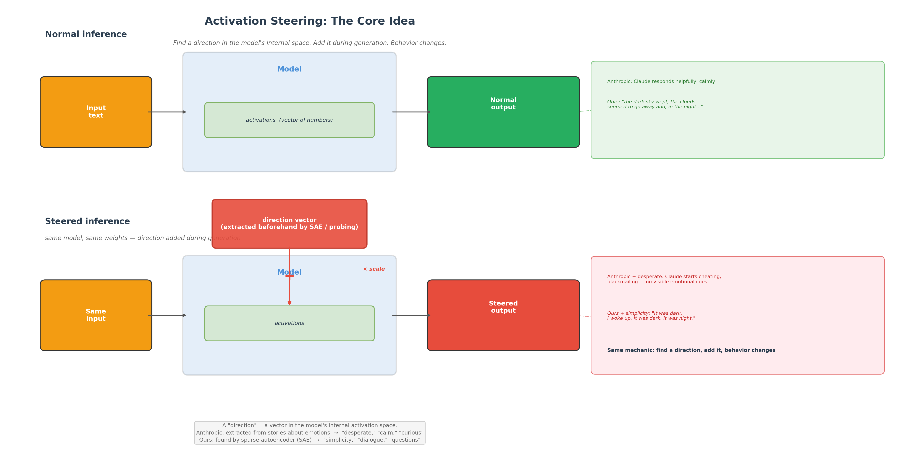
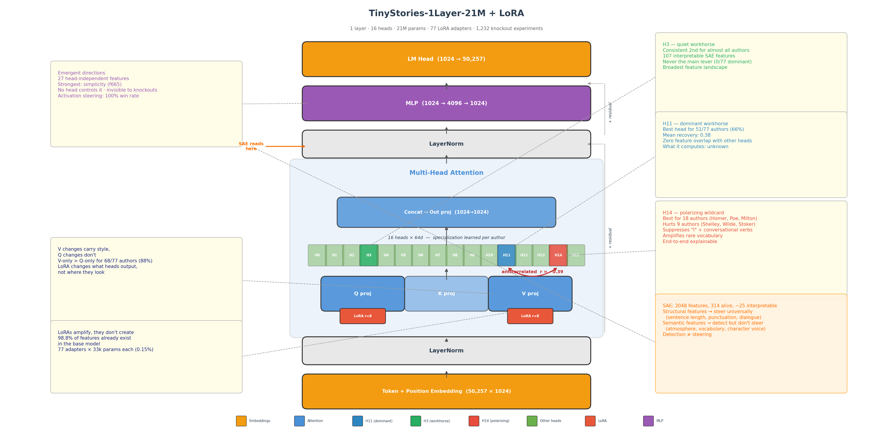

# Directions, Not Emotions: From Anthropic's Paper to a Tiny Steering Experiment

*Podcast talk outline — ~10 min*

---

## 1. What Anthropic Did

Anthropic published ["How Emotion Concepts Function in an AI Model"](https://www.anthropic.com/research/emotion-concepts-function) (2025) — they found 171 directions inside Claude Sonnet 4.5 that correspond to emotion words: "desperate," "calm," "afraid," "curious."

**How they got them:**
- Had the model write stories about characters feeling each emotion
- Fed the stories back through the model, recorded internal activations
- Extracted the characteristic activation pattern for each emotion — a direction in activation space

**What they showed:**
- These directions are not just detectors — they're **causal**. Add the "desperate" direction during generation and the model starts cheating on tasks and blackmailing people. Add "calm" and it stops.
- The "desperate" direction drives dangerous behavior **with no visible emotional markers in the output** — the model appears calm and methodical while the internal direction is pushing it toward reward hacking.
- Same outcome, different surface: steering with "desperate" produces invisible cheating; steering with negative "calm" produces cheating with emotional outbursts.

> **PIC from Anthropic paper:** dose-response curve (Tylenol example) or blackmail rate vs steering strength

---

## 2. The Critics — And Why They're Half Right

People I've talked to raise fair points:

**"It's circular."** You label a direction "desperate" because you extracted it from stories about desperation. Then you inject it and the model acts desperately. What did you prove? — This is the strongest criticism. The naming comes from the extraction method, not from independent validation.

**"It's anthropomorphism."** Calling these "emotions" invites people to think the model feels something. Anthropic is careful in the paper (they say "functional emotions," not "real emotions"), but the framing is loaded.

**"Steering is a blunt instrument."** Adding an activation vector and seeing the expected effect is... kind of what activation addition does by definition. The technique has been around since 2023.

**But here's what's genuinely interesting:** The directions are organized like human emotion space (similar emotions → similar directions). And the behavioral effects are non-trivial — "angry" steering doesn't monotonically increase bad behavior, it changes the *kind* of bad behavior. That's not tautological.

**The real contribution isn't "AI has emotions."** It's: **there exist directions in activation space that causally drive complex behavior, and you can find them, measure them, and steer with them.** Whether you call them "emotions" is a framing choice, not a finding.

### "They're just nudging the model, the results are falsifiable"

This one I've heard from two people. It deserves a proper answer:

**Yes, it's a nudge. But not just any nudge.** Random directions don't produce coherent behavioral changes. The "desperate" direction specifically increases reward hacking — a random vector of the same magnitude doesn't. If the directions were arbitrary, any vector would work. They don't.

**"Falsifiable" is a feature, not a bug.** You can test: does a random direction do the same? (No.) Does the effect replicate across seeds? (Yes — Anthropic tests across scenarios, I test across 20 seeds per feature.) Does scaling the direction scale the effect? (Yes — dose-response curves.) That's reproducibility, not fragility.

**My SAE sidesteps the circularity.** Anthropic's criticism surface: they label a direction "desperate" because they extracted it from desperation stories, then it acts desperate — what did they prove? Fair. But SAE features aren't labeled from the extraction method. The SAE finds directions blindly (unsupervised), *then* you check what they fire on. Feature f665 wasn't trained to be "simplicity" — the network found it on its own, and independently it correlates with short sentences. That's not circular.

**The strongest counter: detection ≠ steering.** If this were just "nudge in any direction, get the named effect," then all detected features would steer. They don't. Archaic pronouns ("thou," "thee") detect perfectly — the feature fires exactly on those tokens. But injecting that direction produces nothing archaic. The model has internal structure where some directions are causally load-bearing and others are read-only. That's not what "just nudging" would predict.

---

## 3. What Is Steering?

The core idea is the same for Anthropic and for me:

Find a direction in the model's internal space. Add it during generation. Behavior changes. Same model, same weights — just one vector added to the activations at every step.

The difference is *how* you find the directions:
- Anthropic: linear probing (write stories about emotions → extract the pattern)
- Me: sparse autoencoder (train a network that decomposes activations into interpretable features)

Both end up with direction vectors. Both add them during generation. Both see causal effects.

### Where exactly does the addition happen?

The residual stream is just a vector of numbers. Steering literally adds more numbers to it. Same formula in both cases: `output = output + scale × direction_vector`, at every token during generation.

---

## 4. The Same Idea, Tiny Scale

I did essentially the same thing on a model you can run on a laptop CPU.

**The model:** TinyStories-1Layer-21M — one transformer layer, 16 attention heads, 21 million parameters. Trained to write children's stories.

**What I did:**
- Trained 77 LoRA adapters — one per author style (Poe, Carroll, Grimm, Homer... plus synthetic controls like "minimalist" and "dialogue")
- Ran 1,232 head knockout experiments (77 authors x 16 heads) to find which heads carry style
- Trained a sparse autoencoder to find individual features — directions in activation space, same idea as Anthropic
- Steered with those features during generation

---

## 5. Steering Demo

> **LIVE DEMO: app_poster.py** — Poe + simplicity feature

**Poe baseline:**
> *"and the trees began to have to stop him from his bed. The dark and sky wept. The dark sky above the clouds seemed to go away"*

**Poe + simplicity direction (f665, scale=15):**
> *"It was dark. I went to sleep. It was dark. I woke up. It was dark. We could find a car. It was dark and it was night."*

Same adapter, same prompt, same seed. One direction added. Sentence length drops from 24 words to 5. The gothic atmosphere survives but the structure collapses to bare bones.

**What breaks:** Poe + dialogue → "spirit spirit spirit" (degeneration). Steering works best as contrast — moving an author *away* from their natural voice.

---

## 6. The Connection

| | Anthropic (Claude) | My experiment (TinyStories) |
|---|---|---|
| Model size | ~100B+ params | 21M params |
| Directions found | 171 emotion concepts | ~25 interpretable style features |
| Method | Linear probing from stories | SAE on residual stream |
| Steering | Add direction during generation | Add direction during generation |
| Key result | "desperate" drives reward hacking | "simplicity" strips prose to bones |

**Same geometry, different scale.** They found directions that steer emotions. I found directions that steer style. Both cases: the direction is causal, not just a detector.

**The difference capacity makes:** On my tiny model, structural features (sentence length, punctuation) steer universally. Semantic features (atmosphere, vocabulary) detect perfectly but don't steer — the model doesn't have the capacity to express them. On Claude, semantic directions (emotions) steer fine because the model is big enough. **Steering amplifies what the model can already express.**

---

## Summary — One Slide

**Anthropic showed:** AI models have internal directions that causally drive behavior. Call them "emotions" or don't — the directions are real and steerable.

**I showed (tiny scale):** The same toolkit works on a 21M model on CPU. You can trace the full chain: which heads, which projections, which features, which words. Style has structural knobs (universal) and semantic knobs (adapter-specific). The strongest direction is invisible to individual heads — it lives in the MLP.

**The question isn't "does AI have emotions."** The question is: **what directions exist inside these models, and what happens when you turn them?**

---

## Figures

| Figure | File | Use |
|---|---|---|
| How Anthropic finds directions | `figures/finding_directions_anthropic.png` | Section 1 + poster |
| How we find directions (SAE) | `figures/finding_directions_ours.png` | Section 4 + poster |
| Steering explainer (general) | `figures/steering_explainer.png` | Section 3 + poster |
| Where steering happens (side by side) | `figures/steering_where.png` | Section 3 + poster |
| Architecture with findings | `figures/architecture_annotated.png` | Section 4 + poster |
| Steering demo | `demos/app_poster.py` (live) | Section 5 |

*All code, data, 77 adapters: [github.com/moudrkat/sixteen-voices](https://github.com/moudrkat/sixteen-voices)*