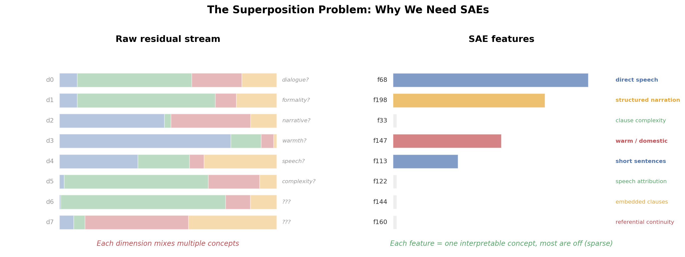
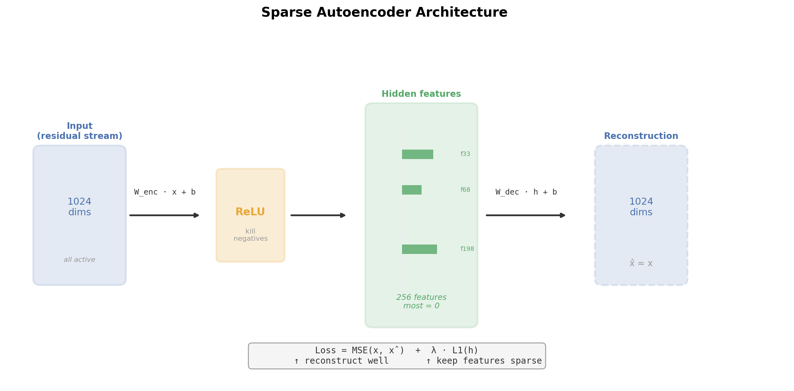
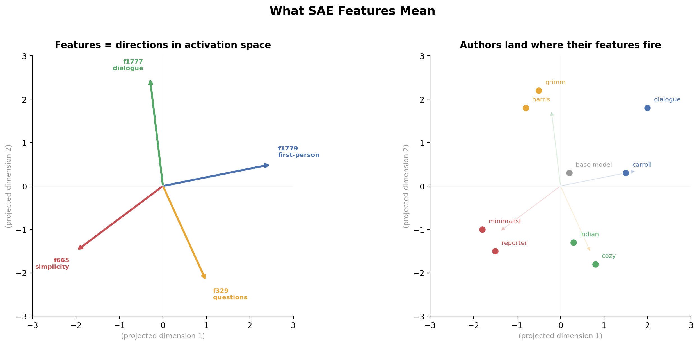
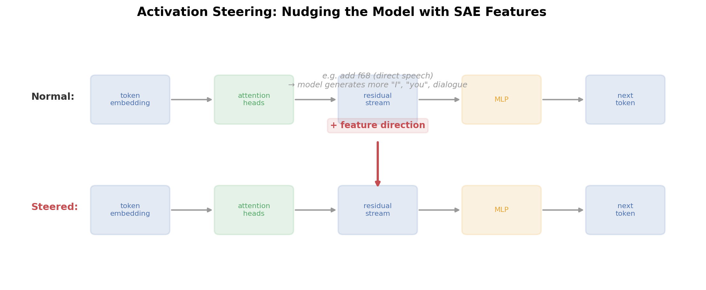

# What is a Sparse Autoencoder (SAE)?

A sparse autoencoder is a tool for understanding what's happening inside a neural network. It takes the tangled, high-dimensional internal representations of a model and decomposes them into individual, interpretable **features** — each one corresponding to a recognizable concept.

---

## The problem: distributed representations

A transformer builds up a representation at each token position — a vector (in our case, 1024 dimensions) called the **residual stream**. This vector contains everything the model knows about what comes next. The problem: individual dimensions don't mean anything on their own. The model uses distributed representations — concepts are spread across many dimensions, mixed together. You can't read off "dimension 47 encodes formality" because formality lives in a pattern across hundreds of dimensions, tangled with everything else.

(In larger models, this gets worse — models can encode more concepts than they have dimensions by cramming them into overlapping directions, a phenomenon called **superposition** [Elhage et al., 2022]. On our tiny model we likely don't see that, but the basic problem of entangled dimensions is the same.)



*Left: raw residual stream dimensions — each one mixes multiple concepts. Right: SAE features — each captures one interpretable concept, and most are off (sparse).*

---

## The solution: learn a sparse dictionary

An SAE learns to decompose the residual stream into a set of **features** that are:

1. **Interpretable** — each feature corresponds to a recognizable pattern (e.g., "direct speech", "narrative structure", "short sentences")
2. **Sparse** — for any given token, only a few features are active. Most are zero.

The combination of interpretability and sparsity is the key insight: by forcing the representation to be sparse, you force each feature to specialize. A feature that only fires occasionally has to capture something specific and meaningful — otherwise it's wasting its limited activation budget.

---

## How it works

The SAE has three components:

### 1. Encoder

A linear map followed by ReLU (rectified linear unit). Takes the 1024-dim residual stream vector and projects it into 256 features. ReLU zeros out anything negative — this is where sparsity begins.

```
h = ReLU(W_enc · x + b_enc)
```

### 2. Decoder

Another linear map that reconstructs the original 1024-dim vector from just the active features.

```
x̂ = W_dec · h + b_dec
```

### 3. Training objective

Minimize two things simultaneously:

```
Loss = MSE(x, x̂) + λ · L1(h)
```

- **MSE(x, x̂)** — reconstruction error. The SAE should be able to rebuild the original vector from its features.
- **λ · L1(h)** — sparsity penalty. The L1 norm penalizes having many features active at once, forcing the SAE to use as few features as possible for each input.

The tension between these two terms is what makes it work: the SAE must reconstruct well (so it can't throw away information) but must also be sparse (so each feature has to count).



*The full pipeline: 1024-dim input → linear encoder → ReLU (kill negatives) → 256 sparse features (most zero) → linear decoder → 1024-dim reconstruction.*

---

## What are "features"?

Each SAE feature is a **direction** in the 1024-dimensional activation space. When we say "feature 68 fires strongly on this token," we mean the residual stream vector at that position points strongly in feature 68's direction.

The decoder columns define these directions. Each column of W_dec is a 1024-dim vector — the direction in activation space that the corresponding feature represents.



*Left: features are directions in activation space. Right: authors land at positions determined by which features fire for their text. Grimm and Harris are near the "narration" direction; dialogue and Carroll are near the "direct speech" direction.*

---

## Why "sparse"?

Standard autoencoders can use all hidden units for every input — they distribute information evenly. This makes them good at compression but bad at interpretation: each unit is a meaningless mix.

Sparsity changes the game. If only 5 out of 256 features can be active for any given token, each feature must capture something genuinely distinct. You can then look at what tokens activate a feature and give it a label: "this feature detects dialogue," "this feature detects narrative scaffolding."

In practice, we check three things to label a feature:
1. **Which tokens fire it?** (what does it literally detect at the word level?)
2. **Which known styles score high or low?** (does it correlate with designed control styles?)
3. **Do the tokens and the styles tell the same story?**

When all three agree, you can trust the label.

---

## What can you do with SAE features?

### Understand the model

By correlating features with other model components (attention heads, MLP, knockout experiments), you can map out *what* the model computes and *where*. For example: "Head 3 reads the formal-vs-simple axis through 37 features" or "Head 14 anti-correlates with interactive speech features."

### Activation steering

Each feature direction can be used as a steering vector. During text generation, you add the feature's direction to the residual stream — nudging the model's predictions toward that concept.



*Normal generation flows through the model unchanged. Steered generation adds a feature direction to the residual stream, nudging output toward that concept (e.g., more dialogue, more narrative structure).*

For example, adding the "direct speech" direction to Poe's adapter turns gothic third-person narration into frantic first-person address. Adding the "structured narration" direction to Grimm amplifies fairy-tale motifs — meadows, grandmothers, princes.

### Discover hidden structure

Some features reveal structure that other analysis methods miss. In our experiment, we found a "structured narration" axis that no single attention head controls — it emerges from multi-head interactions through the MLP. This axis was invisible to head knockout experiments but discoverable through the SAE.

---

## Overcomplete vs undercomplete

Standard practice in mechanistic interpretability uses **overcomplete** SAEs — more features than input dimensions (e.g., 4096 features for a 1024-dim space). The idea: the model uses superposition to pack more concepts than it has dimensions, so you need more features to unpack them all.

In our experiment, overcomplete didn't work well. On a small 21M-parameter model, overcomplete features weren't sparse — too many fired at once, defeating the purpose. We used an **undercomplete** SAE (256 features for 1024 dims) which forced features to specialize. This is consistent with the observation that feature quality degrades on smaller models (Cunningham et al., 2024).

---

## Key references

- Bricken et al., [Towards Monosemanticity](https://transformer-circuits.pub/2023/monosemantic-features), Anthropic, 2023 — the foundational SAE-for-interpretability paper.
- Templeton et al., [Scaling Monosemanticity](https://transformer-circuits.pub/2024/scaling-monosemanticity/), Anthropic, 2024 — scaling SAEs to large models.
- Cunningham et al., [Sparse Autoencoders Find Highly Interpretable Features in Language Models](https://arxiv.org/abs/2309.08600), ICLR 2024 — systematic evaluation of SAE feature quality.
- Turner et al., [Activation Addition](https://arxiv.org/abs/2308.10248), 2023 — the activation steering technique.