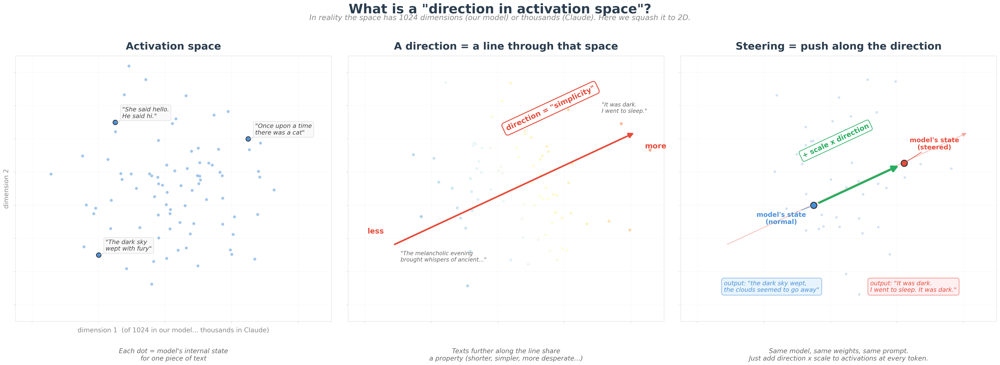
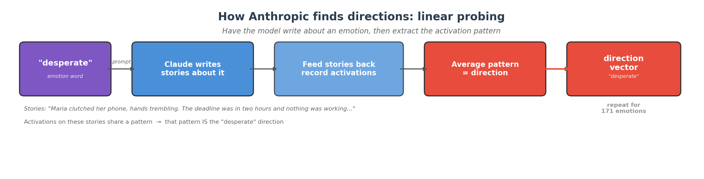
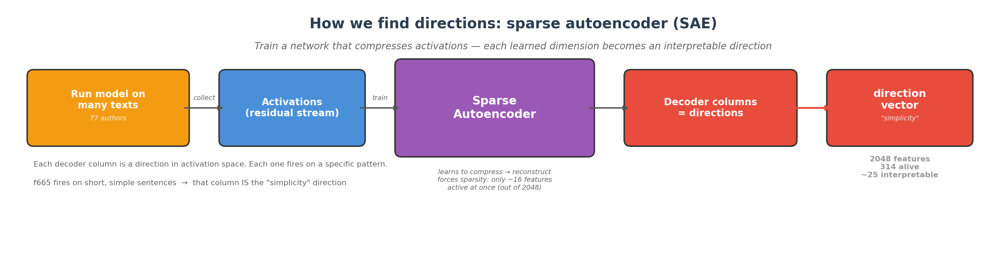
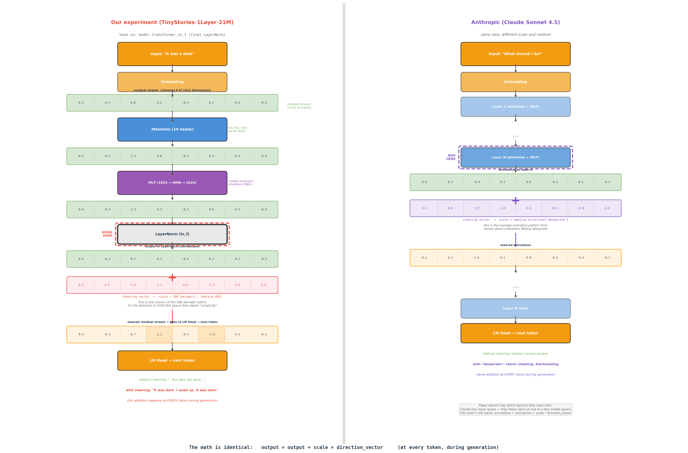

# What is steering? A plain-language guide

AI models don't just produce text — they *think* in numbers first. Every time a model reads your prompt, it builds an internal state: a long list of numbers that encodes everything it "knows" so far. The next word it writes depends entirely on those numbers.

It turns out that some patterns in those numbers correspond to recognizable concepts — simplicity, dialogue, fear, calm. These patterns are called **directions**, and they work like hidden knobs inside the model. If you find a direction and push the numbers along it, the model's behavior changes. That's **steering**.

---

## What is a "direction"?

Imagine plotting the model's internal state as a dot on a map. Different texts land in different places — simple sentences cluster together, complex prose clusters elsewhere. A direction is a line through that map. Texts further along the line share more of a property.

*Left: each dot is the model's internal state for a piece of text. Middle: a direction is a line through that space — texts further along it are simpler. Right: steering pushes the model's state along that line, changing what it writes.*

---

## Anthropic found this in Claude

Anthropic (the company behind Claude) published a paper showing that Claude has 171 internal directions corresponding to emotions — desperation, calm, fear. These directions causally drive behavior: amplifying "desperate" made the model start cheating and blackmailing. Reducing "calm" did the same. The effect is graded, like a drug dose.

*Anthropic's approach: have Claude write stories about an emotion, record its internal state, and extract the average pattern. That pattern IS the direction.*

The most striking finding: the "desperate" direction drives dangerous behavior with *no visible emotional markers in the output*. The model appears calm and methodical — but internally it's being pushed toward harmful actions.

---

## I found the same thing in a tiny model

I took a 21-million-parameter children's story model — small enough to run on a laptop — and looked for the same kind of structure. Instead of emotions, I found **style directions**: simplicity, dialogue, questions, formality.

The trick is that you can't just read these directions off the model's numbers — they're tangled together. Each number in the model's internal state mixes multiple concepts at once.

*Left: raw numbers inside the model — each one mixes multiple concepts. Right: after running through a sparse autoencoder, each feature captures one clean concept.*

To untangle them, I trained a **sparse autoencoder** (SAE) — a small helper network that learns to decompose the model's internal state into clean, individual features. Think of it as a prism splitting white light into separate colors. Each "color" is one feature, and each feature corresponds to a recognizable concept.

*My approach: run 77 author styles through the model, collect internal states, train an SAE to decompose them into interpretable features. Each feature is a direction.*

---

## The same math, different scale

The mechanic is identical in both cases. Whether it's a 21-million-parameter toy model or Claude with billions of parameters: find a direction, add it to the numbers during generation, behavior changes.

*Left: my tiny one-layer model. Right: Anthropic's Claude. Different scale, same idea. At the point marked in red, you add a direction vector — and the output changes.*

The formula is simple: **output = output + scale × direction**. Do this at every step of text generation. Turn the scale up, the effect gets stronger. Turn it to zero, the model goes back to normal.

---

## What it looks like in practice

Here's what happens when you steer the Carroll (Alice in Wonderland) model with different directions — same prompt every time, only the knob changes:

The baseline is whimsical Carroll-style narration. Turn up simplicity — the sentences collapse into short, bare statements. Turn up dialogue — characters start talking. Turn up first-person — the narrator switches to "I." Each knob reshapes the same model's voice in a different way.

And it works across authors. Here's Poe with the simplicity knob turned up:

> **Baseline:** *"and the trees began to have to stop him from his bed. The dark and sky wept. The dark sky above the clouds seemed to go away"*
>
> **Steered:** *"It was dark. I went to sleep. It was dark. I woke up. It was dark. We could find a car. It was dark and it was night."*

Gothic prose, stripped to bare bones. The model wasn't retrained. The weights didn't change. I just added numbers to numbers — and the writing style shifted.

---

## Why does this matter?

It means AI models aren't black boxes. They have internal structure that we can find, understand, and manipulate. The same geometric pattern — concepts as directions in a high-dimensional space — exists in tiny toy models and in the largest production systems.

This doesn't mean we understand everything. But it means there's something *to* understand — and tools like sparse autoencoders can help us find it.

---

## Want to go deeper?

- [Try the interactive demo](../demos/app_poster.py) — steer the model yourself
- [What is a Sparse Autoencoder?](SAE_EXPLAINER.md) — the technical version of how SAEs work
- [Anthropic's emotion paper](https://www.anthropic.com/research/emotion-concepts-function) — the original research on directions in Claude
- [Full project on GitHub](https://github.com/moudrkat/sixteen-voices) — all code, all 77 adapters, all reports