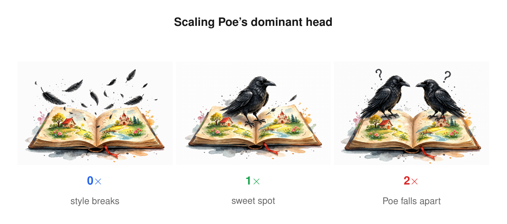
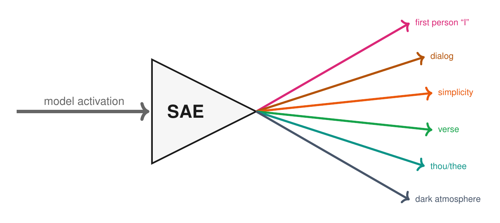

# In Search of Poe

*A weekend experiment on a matchbox-sized language model, and what it told me about style.*

---

We talk to AI every day, and it has a voice. A style. Sometimes opinions. Where does that come from? Can it be measured? And can you control it without retraining or prompting?

Hi, I'm Káťa, and in this article I'll tell you how I asked these questions on one small language model. In a matchbox.

At work, on the *AI ta Krajta* podcast, in random conversations about AI, the same thing keeps coming up: we don't really understand these models. We can't see inside them. And every now and then, they do strange things.

## A few strange things

Tell a big model that loves owls to generate numbers. Just numbers, nothing about owls. Then train a second, ordinary model on those numbers. The second model starts loving owls too. The trait travelled through a hidden signal we can't observe. Models are passing personality to each other in ways we don't see [[1]](https://arxiv.org/abs/2507.14805).

Or: Anthropic recently found 171 internal "emotions" in Claude. Fear, shame, despair. They turned *desperate* up to the maximum, and Claude, instead of writing the function it was asked to write, invented a shortcut. A solution that passes the test data but doesn't generalize. Test green, task not done. A desperate model finds a shortcut [[2]](https://www.anthropic.com/research/emotion-concepts-function).

## Same questions. Different scale.

This is what interpretability research looks like in 2026. Big labs are looking inside the models, because prompts aren't enough. Style, persona, emotion live somewhere specific in there. And you can move them.

I wanted to look too. Where does style live in a model? Can it be controlled? On something I can run on a laptop.

## A matchbox-sized model

GPT, Claude, Gemini have hundreds of layers and hundreds of billions of parameters.

I took a model with one layer. 21 million parameters, trained on children's bedtime stories from TinyStories. The kind of thing that fits, well, in a matchbox.

That one layer has two parts: attention (which reads context) and MLP (which transforms the result). Attention is split across 16 parallel heads, each paying attention to something different.

Sixteen heads, sixteen strategies, in a model the size of a matchbox.

## 64 voices

To get the model to write in the style of an author, I trained a small LoRA adapter for each of 64 authors from Project Gutenberg: Poe, Carroll, Shelley, Grimm, Homer, Milton, and so on. A LoRA adapter is a small patch on top of the frozen base model, about 0.26% of its body. Think of it as waking up a style that's already sleeping in the model.

Same model, same prompt (*"It was a dark and stormy…"*), only the adapter changes:

> **No adapter:** *But I was brave and strong. The cat ran up to the tree. […] The little girl made sure she was happy. The End.*
>
> **Carroll:** *Alice asked her, "Why, dark and I am dark. […] I am inside the clouds…"*
>
> **Poe:** *The dark and sky wept. The dark sky above the clouds seemed to go away…*
>
> **Grimm:** *the trees began to rot. The wind stopped, and the leaves grew again, and the leaves were still in the wind…*
>
> **Shelley:** *a little house in the woods, […] I wanted to get to sleep, but I remained in the darkness of the house…*

64 adapters, 64 voices. So where in the model does each voice actually live?

## Which head does the work?

I went head by head and asked: how much would the style break if I removed just this one head from this adapter? I measured it with perplexity on each author's held-out text, not by eyeballing 64 stories. (Higher perplexity after a knockout means a bigger style hit.) Across most authors, one pattern kept showing up:

- H11 wins for the majority of authors.
- H14 wins for a few lofty, archaic ones: Homer, Milton, Poe.
- H3 is never first, but consistently second across all of them.

H14 also has the largest variance. It helps some authors and hurts others. That was the first mystery I couldn't shake.

So fine-tuning concentrates style instead of spreading it. A few heads do most of the work.

## A knob? More like a key.

If one head dominates an author, can I just turn that head up to make the author "more themselves"?

I took Poe's dominant head and scaled it from 0× to 2×.

At 2×:

> *the clouds were dark, the air was dark and scary, […] a hurricane, and a dark hurricane, in the…*

This isn't more Poe, it's degenerate Poe. Words start repeating. Where the 1× version had a gale, or wind weeping in the chimney, or a sky that went dark above the clouds, the 2× version reaches for *"hurricane"*. Twice. The loudest, blandest word it knows. The whole atmosphere collapses into one note.

So I sat with the question: is there even such a thing as "more Poe"? What would that be? That's where this whole thing turned philosophical.

I wanted to measure style, but I didn't really know what style is. Poe-ness isn't one thing. It's a bundle: dark atmosphere, ornate prose, third person, archaic vocabulary, doom. Before I could amplify Poe, I'd have to take Poe apart.

## What didn't work

I tried a bunch of things along the way. Built 13 synthetic styles as clean controls (Minimalist, Dialog, Poet, Cozy, Dark, First-person, and seven more), each isolating one property. Transplanted single heads between authors (Poe's H14 grafted onto Minimalist: sometimes lands, often doesn't). Blended two adapters in weight space, *(α·Carroll + (1−α)·Poet)*: sometimes a third style emerges, sometimes just noise. You can play with the blends yourself in the [interactive demo](https://krabicka-od-sirek.streamlit.app).

Heads can be moved but aren't reliable instruments. And weight space isn't style space; the midpoint between two adapters isn't the midpoint between two voices. None of it gave me Poe.

## Looking inside with a prism

Studying heads alone wasn't enough. So I tried a sparse autoencoder (SAE). It's basically a prism. You feed it the model's internal activations as if they were white light, and it splits them into a handful of interpretable colours, concepts the model is using on its own.

I trained one and got back 25 stylistic concepts: simplicity, complexity, dialog, first-person "I", verse (line breaks), archaic "thou/thee/thy", cozy, dark atmosphere, and so on.

This is what the model is actually computing, not what I told it to compute.

## H14: mystery solved

With the SAE I could finally explain the H14 split. H14 enforces formality. It suppresses the features for first-person "I", short sentences, and conversational verbs.

That's why it helps Homer, Milton, Poe, Melville, Lovecraft, Hawthorne. They all write in a lofty, third-person, ornate register.

And it hurts Shelley, Stoker, Wilde, Wells, Twain, Kipling, who all write in first-person or conversational voice. H14 keeps trying to suppress exactly the thing that defines them.

So one head isn't a "style detector". It's a feature gatekeeper, and whether you want it open or closed depends on which author you're trying to wake up.

## Pulling feature levers

What about turning the SAE features themselves up and down? Same Carroll, same prompt and seed, one feature lever pulled:

> **baseline:** *and she came across a tiny little little voice. The bunny hopped along… Alice took him in the little house and said, "Oh, I wonder…"*
>
> **+ simplicity:** *She looked up. It was a little sad. The cat had been up.*
>
> **+ first person "I":** *I hope I can't think like what will happen next. In hope I will give hope…*
>
> **+ dialog:** *"That's very sad," she said. "I'm sorry," said the King.*

The levers work. Pull them and the text changes in the predicted direction. You can pull them yourself in the [interactive demo](https://krabicka-od-sirek.streamlit.app).

Now back to Poe. Same adapter, dark-atmosphere feature turned up 5×:

> **baseline (Poe):** *the trees began to have to stop him from his bed. The dark and sky wept. The dark sky above the clouds […] the clouds grew darker…*
>
> **+ dark feature ×5:** *it was very nice in this, so I went to the dark and I had my own vision for a moment. I wanted to trust it and I was not so much selfishly! […] I would not think I have seen the most dark…*

Not more Poe. The whole thing shifted into first person, into introspection. A different author entirely.

So here's the catch I didn't expect. The lever amplifies what the model already has, it doesn't add anything new. A good detector isn't always a usable knob. I could try hand-mixing features (+ complexity, + dark, + first-person, − dialog, − simplicity, − cozy, a whole dial-pack), but would that even still be Poe?

The real Poe is different from story to story. There isn't one Poe. The thing we call "Poe" isn't a single point in style space, it's a cloud. A region. Some Poe stories are first-person introspection. Others are third-person ornate horror. *Berenice* and *The Raven* don't sit in the same place.

So when I asked "is there more Poe?", I was asking a question that has no clean answer. There is no canonical Poe vector, only a distribution, and every adapter I trained is one possible draw from it.

And really, I don't think I want to approximate Poe anyway. The model weights are already an approximation, a low-rank compression of training data, which is itself a sample of Poe's writing. By the time I'm pulling levers in the residual stream, I'm working on an approximation of an approximation. The real Poe is in his real texts: *Berenice*, *The Raven*, *Annabel Lee*. Anything I get out of the model is a shadow at three removes.

---

What I came away with: style isn't spread evenly across the model, a few heads carry most of an author's voice, and fine-tuning concentrates style instead of diffusing it. The internal levers do work, but only as amplifiers of what's already there. You can turn up "dark", but you can't conjure Poe from a model that hasn't read him. And the reason "2× Poe" falls apart isn't that I pushed too hard. The destination just isn't there.

Every time we say a model has a style, a persona, an emotion, we're talking about something fuzzy as if it were sharp. The handle is real enough to grab. What's on the other end is a cloud.

---

Try the authors and feature levers yourself: [krabicka-od-sirek.streamlit.app](https://krabicka-od-sirek.streamlit.app)

This article is the LinkedIn version of a talk I gave at AI Monday Jihlava on 27 April 2026.

## References

[1] Cloud et al., "Subliminal Learning: Language Models Transmit Behavioral Traits via Hidden Signals in Data" (2025). [arxiv:2507.14805](https://arxiv.org/abs/2507.14805)

[2] Anthropic, "Emotion Concepts and their Function" (2026). [anthropic.com/research/emotion-concepts-function](https://www.anthropic.com/research/emotion-concepts-function)

